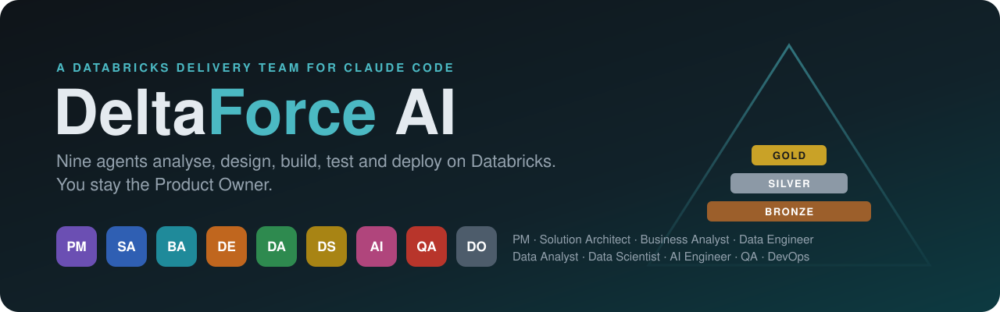
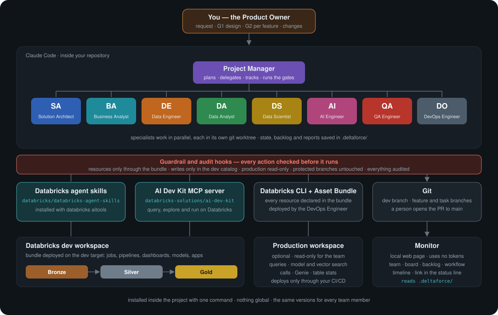
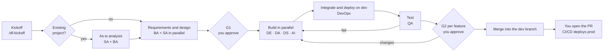
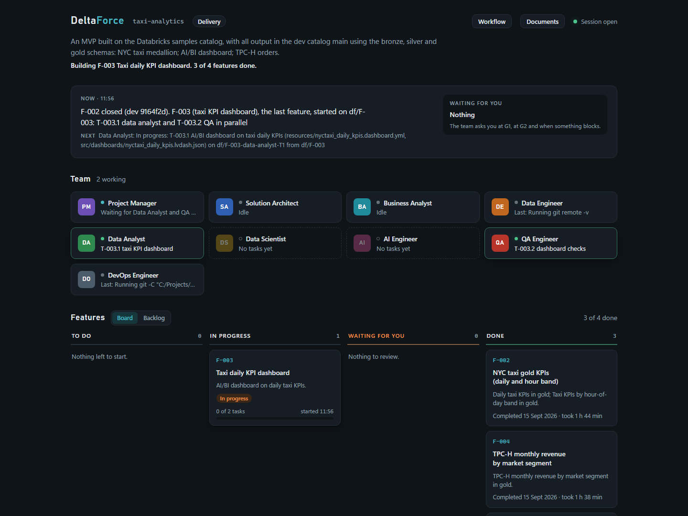
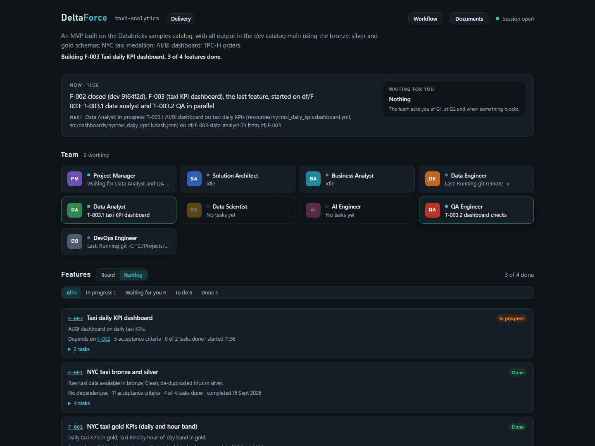
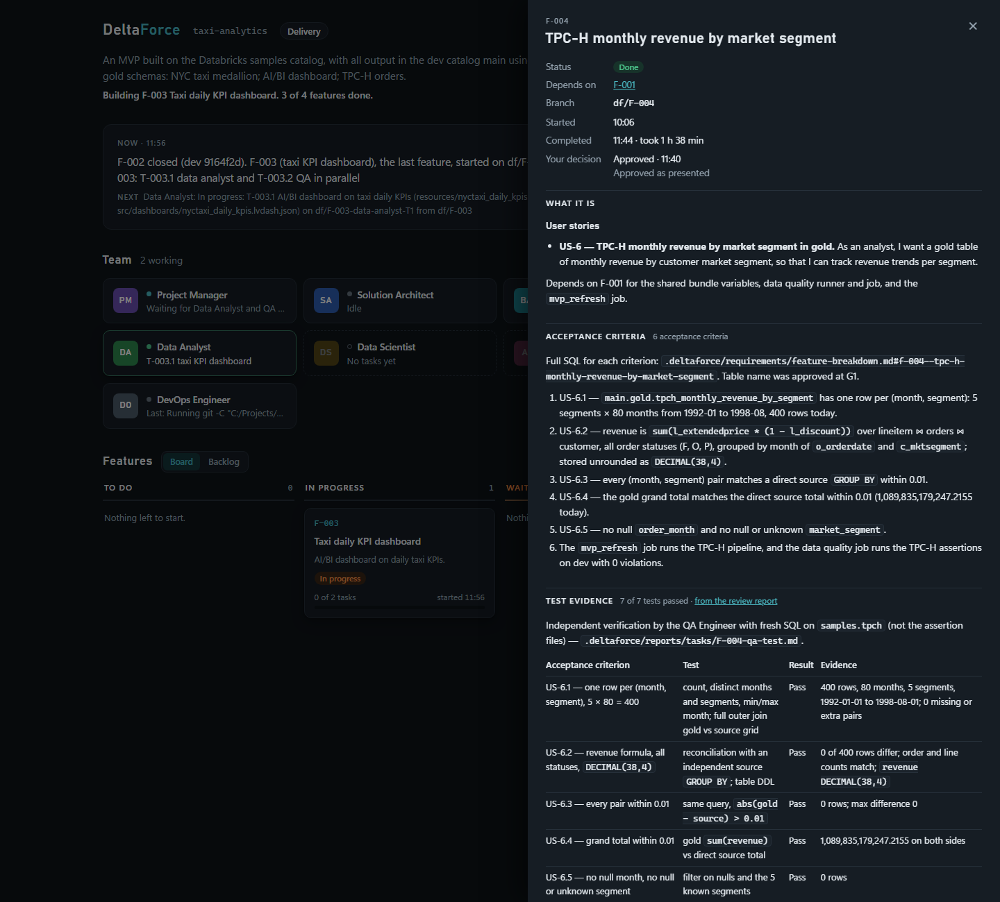
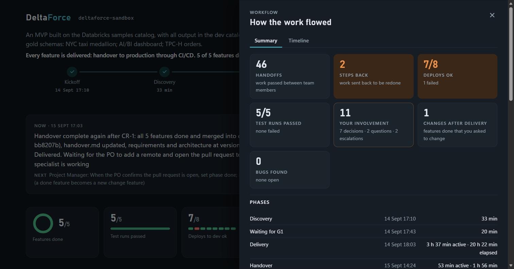
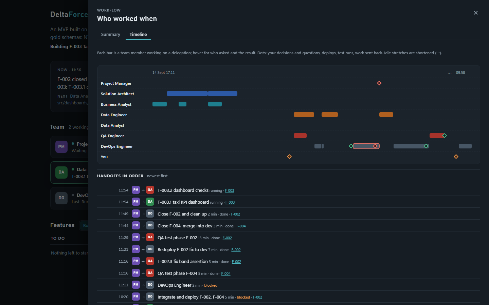

<p align="center">
  
</p>

<p align="center">
  
  
  
  
</p>

---
> 📣 **Built on official Databricks tooling**
>
> DeltaForce does not reinvent Databricks knowledge. The installer retrieves the **Databricks agent skills** from
> [databricks/databricks-agent-skills](https://github.com/databricks/databricks-agent-skills) through the Databricks CLI
> (`databricks aitools install`) and the **MCP server of the Databricks AI Dev Kit** from
> [databricks-solutions/ai-dev-kit](https://github.com/databricks-solutions/ai-dev-kit), at pinned versions and inside your project.
> DeltaForce adds what a delivery team needs around them: roles, process, gates, guardrails, audit and a live monitor.
---

**You describe what you need** — a new data product, or a change to a project that already exists — and a team of nine specialized Claude Code agents analyses, designs, builds, tests and deploys it on Databricks. You approve the design and every feature; the team does the rest and asks you only when something needs your decision.

> **Status**: installer, agents, process, guardrails and audit, existing projects, monitor — implemented and validated end to end on a Databricks workspace. What comes next: [docs/roadmap.md](docs/roadmap.md). Architecture and process: [docs/design.md](docs/design.md).

## Get Started

| Option | Best for | Start here |
|---|---|---|
| :star: [**Install into a project**](#quick-start) | **Start here!** A new folder or an existing Databricks repository, from the VS Code terminal, with one command | [Quick Start](#quick-start) |
| [**Work with the team**](#work-with-the-team) | Kickoff, approvals, changes: the five commands you use as Product Owner | [Commands](#commands) |
| [**Watch the team**](#watch-the-team) | See who is working on what, the backlog, the tests and the workflow in your browser, without spending tokens | [Monitor](#watch-the-team) |
| [**Update or remove**](#update-reconfigure-or-remove) | Keep DeltaForce current in a project | [Update](#update-reconfigure-or-remove) |

---

## AI-Assisted Delivery on Databricks

<table>
<tr>
<td width="50%" align="center" valign="top">

<br>


<br><br>

**Decide what to build — and approve it**

Describe the request at kickoff, approve the design and the feature list (**G1**), validate every delivered feature with its test evidence (**G2**), ask for changes at any time. A person — you — opens the pull request to production.

</td>
<td width="50%" align="center" valign="top">

<br>


<br><br>

**Analyse, design, build, test and deploy on dev**

A Project Manager coordinates eight specialists who work in parallel, each in its own git branch: requirements and architecture documents, pipelines, dashboards, models and agents declared in a Databricks Asset Bundle, deployed and tested on the dev workspace.

</td>
</tr>
</table>

---

## What Can the Team Build?

- **Lakeflow Declarative Pipelines** — ingestion and bronze → silver → gold, Auto Loader, data quality expectations
- **Databricks Jobs** — refresh workflows, multi-task jobs, data quality test jobs
- **AI/BI Dashboards, Metric Views and Genie spaces** — KPIs and analytics on gold
- **Unity Catalog objects** — schemas, tables, volumes, inside the dev catalog
- **ML models** — realistic data samples, features, baselines and model challenges, training and tuning with MLflow, champion and challenger in Unity Catalog, serving, monitoring and retraining; Hugging Face models fine-tuned and served on Databricks
- **GenAI** — document processing, vector search, RAG and agents (custom or Agent Bricks), evaluation datasets and model challenges, MLflow evaluation and tracing, model serving, Databricks Apps
- **Extensions of existing projects** — the team first analyses the codebase and what is deployed, then designs the change

Every resource is declared in the **Databricks Asset Bundle** with parametric names (`${var.catalog}`, `${var.schema_gold}`, …) and follows the **medallion** layers.

---

## Meet the Team

| Role | What it does | Databricks skills it uses |
|---|---|---|
| **Project Manager** | The only one who talks to you. Plans, delegates, tracks backlog and state, runs the gates | `databricks-core` |
| **Solution Architect** | Designs the solution — medallion flows, tables, bundle layout — and checks the work follows it | `databricks-dabs`, `databricks-unity-catalog`, `databricks-metric-views`, `databricks-docs` |
| **Business Analyst** | Business objectives, expected value, requirements, acceptance criteria, the repository documentation | `databricks-data-discovery` |
| **Data Engineer** | Ingestion and bronze, silver, gold pipelines and jobs | `databricks-pipelines`, `databricks-jobs`, `databricks-dabs`, `databricks-lakeflow-connect`, `databricks-spark-structured-streaming` |
| **Data Analyst** | Gold marts, metric views, AI/BI dashboards, Genie spaces | `databricks-dbsql`, `databricks-aibi-dashboards`, `databricks-metric-views`, `databricks-data-discovery` |
| **Data Scientist** | The ML expert: realistic samples, features, baselines and model challenges, training, champion and challenger in Unity Catalog, serving, monitoring and retraining — Hugging Face models included | `databricks-ml-training`, `databricks-synthetic-data-gen`, `databricks-python-sdk`, `databricks-execution-compute`, `databricks-model-serving` |
| **AI Engineer** | The GenAI expert: RAG and agents (custom or Agent Bricks), evaluation datasets and model challenges, prompts and tracing, serving, apps — Hugging Face models included | `databricks-agent-bricks`, `databricks-vector-search`, `databricks-model-serving`, `databricks-mlflow-evaluation`, `databricks-ai-functions`, `databricks-apps-python`, `databricks-execution-compute`, `databricks-unstructured-pdf-generation` |
| **QA Engineer** | Data quality, integration and regression tests on the deployed feature; ML and GenAI results recomputed on its own | `databricks-dbsql`, `databricks-mlflow-evaluation`, `databricks-synthetic-data-gen`, `databricks-execution-compute` |
| **DevOps Engineer** | The only one who integrates, deploys to dev and merges into the dev branch; owns CI/CD | `databricks-dabs`, `databricks-jobs`, `databricks-pipelines` |

Every role also gets `databricks-core` and its own list of Databricks MCP tools. The Data Scientist and the AI Engineer also get the Hugging Face skills.

### Skills

Skills are instructions Claude Code loads into an agent's context. The team uses four kinds, all installed in the project's `.claude/skills/` and off-limits to the agents:

- **Your commands** (`df-*`, 5) — you type them; the model cannot start them on its own.
- **DeltaForce process skills** (`df-*`, 7) — how this team works: formats, git rules, standards, MLOps and AIOps. Hidden from the `/` menu; *preloaded* ones are in the agent's context on every task, the others load when needed.
- **Databricks agent skills** (`databricks-*`, 23) — the official Databricks platform knowledge, per role in the table above, loaded when needed.
- **Hugging Face skills** (7) — the official Hugging Face know-how to choose, size and fine-tune models, for the Data Scientist and the AI Engineer, always at the latest version. The team applies it on Databricks: publishing to the Hugging Face Hub and Hugging Face Jobs are blocked.

| Skill | Kind | Used by | What it holds |
|---|---|---|---|
| `/df-prepare` | Your command | You | What to bring to the kickoff and how the team works — read-only, run it before `/df-kickoff` |
| `/df-kickoff` | Your command | You | Readiness check, new or existing project, the request, table names, rules on existing data, client conventions, CI/CD templates, environments — then the team starts |
| `/df-status` | Your command | You | Where the project stands and what waits for you; read-only |
| `/df-approve` | Your command | You | Approve the design and feature list (G1) or a delivered feature (G2) |
| `/df-changes` | Your command | You | Changes at G1, to a feature under review or already done, or to the request |
| `/df-conventions` | Your command | You | Show or change the client conventions: deploy folder, naming, tags, code style, environments, CI/CD templates, rules on existing data |
| `df-handoff` | Process, preloaded | Every role | What a delegation must contain, how specialists report back, nested delegation, when to escalate |
| `df-backlog` | Process, preloaded | Project Manager | `state.yaml`, feature files, task and feature statuses, PO review reports, `df events` and `df validate` |
| `df-engineering-standards` | Process, preloaded | Solution Architect, builders, QA, DevOps | Medallion layers for data engineering, analytics, ML and GenAI; bundle variables instead of literal names; project layout, naming, data quality; a mandatory description on every object the team creates; client conventions over the defaults |
| `df-readme` | Process, preloaded | Business Analyst | The documentation of the repository: the root README written for you — what each dashboard shows, which questions the Genie space answers, what each job does through which medallion layers and on which trigger — and a short README in every source folder |
| `df-git-flow` | Process, preloaded | Builders, QA, DevOps, Business Analyst | Dev, feature, task and integration branches; worktrees; commit trailers; merges; forbidden operations |
| `df-testing` | Process — preloaded by QA, on demand for the others | QA Engineer, builders | How to run code before handing it over (local, on the warehouse, a one-off job run, then the deploy); data quality, integration and end-to-end tests; ML metrics and GenAI evaluation thresholds; quality regression against the baseline approved at G2; evidence |
| `df-pipelines` | Process, on demand | Data Engineer, Solution Architect, QA Engineer | Ingestion and schema evolution; change data capture and slowly changing dimensions; quarantine tables instead of silent drops; idempotency, backfills, late and out-of-order data |
| `df-bi` | Process, on demand | Data Analyst, Solution Architect, QA Engineer | Analytics strategy in the Architecture; one definition per KPI in a metric view; gold modelled for consumption; dashboard design; Genie space curation and the question set that verifies its answers; permissions and cost |
| `df-mlops` | Process, on demand | Data Scientist, Solution Architect, QA Engineer | ML operations strategy in the Architecture; realistic samples and splits without leakage; baseline and model challenge with a leaderboard; champion and challenger in Unity Catalog; serving, monitoring, retraining; Hugging Face models on Databricks |
| `df-aiops` | Process, on demand | AI Engineer, Solution Architect, QA Engineer | AI operations strategy; realistic evaluation datasets; baseline and challenge between models, retrieval and prompts; MLflow evaluation, tracing and Prompt Registry; serving and AI Gateway; monitoring; Agent Bricks |
| `databricks-core` | Databricks | Every role | Databricks CLI, authentication and workspace basics |
| `databricks-dabs`, `databricks-unity-catalog`, `databricks-docs`, `databricks-metric-views`, `databricks-data-discovery`, `databricks-pipelines`, `databricks-jobs`, `databricks-lakeflow-connect`, `databricks-spark-structured-streaming`, `databricks-dbsql`, `databricks-aibi-dashboards`, `databricks-ml-training`, `databricks-synthetic-data-gen`, `databricks-python-sdk`, `databricks-execution-compute`, `databricks-agent-bricks`, `databricks-vector-search`, `databricks-model-serving`, `databricks-mlflow-evaluation`, `databricks-ai-functions`, `databricks-apps-python`, `databricks-unstructured-pdf-generation` | Databricks | The roles in [Meet the Team](#meet-the-team) | Bundles, Unity Catalog, pipelines, jobs, SQL, dashboards, running code, ML, vector search, serving, apps, test documents for RAG — installed only for the enabled roles |
| `huggingface-best`, `hf-mem`, `huggingface-datasets`, `train-sentence-transformers`, `trl-training`, `huggingface-llm-trainer`, `huggingface-vision-trainer` | Hugging Face | Data Scientist, AI Engineer (vision: Data Scientist) | Choosing models by task and benchmark, memory estimates, inspecting datasets, fine-tuning recipes for embeddings, rerankers, language and vision models |
| `ecosystem-primer`, `langchain-fundamentals`, `langchain-python-quickstart`, `langchain-rag`, `langchain-middleware`, `langgraph-fundamentals`, `langgraph-python-quickstart`, `langgraph-human-in-the-loop`, `eval-engineering` | LangChain | AI Engineer | Agent and RAG patterns with LangChain and LangGraph, always at the latest version. Whatever the framework, the agent is logged, registered and evaluated with MLflow in Unity Catalog and served by a Databricks endpoint |

*Builders* are the Data Engineer, Data Analyst, Data Scientist and AI Engineer. Which skills each agent preloads is in its template, [`templates/claude/agents/`](templates/claude/agents/); the Databricks, Hugging Face and LangChain skills per role in [`lib/data/roles.yaml`](lib/data/roles.yaml). A skill keeps what is needed on every task in `SKILL.md` and the rest in `references/`, read only when it applies — `df-engineering-standards`, for instance, keeps code examples, existing-project rules, production reads and the table of known failures there.

---

## Architecture

<p align="center">
  
</p>

- **Agents in Claude Code.** Every session in the project starts as the Project Manager, who delegates to the specialists — several at once when their work is independent, each in its own git worktree and branch.
- **Everything is in files.** Request, Functional Analysis, Architecture, backlog, task reports, review reports and project state live in `.deltaforce/`, committed with the code. Close Claude Code at any time: the next session continues from there.
- **Guardrails, not just instructions.** Hooks check every action of every agent before it runs, also in auto mode, and every Databricks call, command and blocked action is audited with the role that made it.

### Where the Databricks Skills and Tools Come From

| Source | What the team gets | How DeltaForce installs it |
|---|---|---|
| [databricks/databricks-agent-skills](https://github.com/databricks/databricks-agent-skills) | The official **Databricks agent skills** — pipelines, jobs, bundles, SQL, Unity Catalog, dashboards, ML, vector search, serving, apps — the union of what the enabled roles need | `databricks aitools install --path .claude/skills` with the project's own Databricks CLI (pinned **v1.16.1**) |
| [huggingface/skills](https://github.com/huggingface/skills) | The official **Hugging Face skills** to choose, size and fine-tune models — only those that apply on Databricks, for the Data Scientist and the AI Engineer | Shallow clone of the latest `main` into a temporary folder at every install, skills copied into `.claude/skills`, commit recorded in `.deltaforce/runtime` and shown by the readiness checks |
| [langchain-ai/langchain-skills](https://github.com/langchain-ai/langchain-skills) | The official **LangChain, LangGraph and Deep Agents skills** for the AI Engineer — the Python ones | Same: shallow clone of the latest `main`, skills copied into `.claude/skills`, commit recorded and checked |
| [databricks-solutions/ai-dev-kit](https://github.com/databricks-solutions/ai-dev-kit) | The **Databricks MCP server**: 40+ tools to run SQL, explore Unity Catalog, follow job and pipeline runs, query vector indexes and serving endpoints, ask Genie | Sparse clone of `databricks-mcp-server` and `databricks-tools-core` at **v0.2.0** into `.deltaforce/runtime/ai-dev-kit`, own Python environment, registered in `.mcp.json` as `databricks` (and `databricks-prod`, read-only, when production is configured) |
| [Databricks CLI](https://docs.databricks.com/aws/en/dev-tools/cli/) | Sign-in, bundle validate / deploy / run | Downloaded into `.deltaforce/bin`; the project profile lives in `.deltaforce/.databrickscfg` |
| This repository | The nine agents, the process skills and your commands, the guardrail and audit hooks, the monitor | Rendered into `.claude/` and `.deltaforce/` from the role catalog |

Versions are pinned in [`lib/data/versions.env`](lib/data/versions.env) — except the Hugging Face and LangChain skills, which follow fast-moving libraries and always take the latest version; each role's skills and MCP tools in [`lib/data/roles.yaml`](lib/data/roles.yaml).

---

## Quick Start

### Prerequisites

| On your machine | Notes |
|---|---|
| Windows 10/11 | macOS and Linux are planned |
| [VS Code](https://code.visualstudio.com/) (or another IDE with an integrated terminal) | The whole installation happens in its terminal |
| [Git for Windows](https://git-scm.com/download/win) | Provides the `bash` that runs the installer |
| [Claude Code](https://code.claude.com/docs) | Checked by the installer, not installed |
| Access to `github.com` | DeltaForce, uv, the Databricks CLI, Python, the AI Dev Kit and the Hugging Face skills are downloaded from there |

| On Databricks | Notes |
|---|---|
| A workspace | Sign-in with OAuth (browser), a personal access token or a service principal |
| A SQL warehouse | Chosen from a list during installation |
| A dev **catalog** | The installer creates the dev schemas in it if missing |

No administrator rights and nothing global: the installer brings its own uv, Databricks CLI and Python. Keep the project on a **short path** (≤ 140 characters, e.g. `C:\Users\<you>\Projects\my-project`) and **outside OneDrive** — the runtime is several hundred MB.

### Install in a project

Open the project folder in VS Code (**File → Open Folder…**), open **Terminal → New Terminal** and paste one line. The installer does the rest — you never create a folder or clone anything by hand.

#### Windows — PowerShell (VS Code default)

```powershell
irm https://raw.githubusercontent.com/alessandro9110/deltaforce-ai/main/install.ps1 | iex
```

#### Windows — Git Bash

```bash
curl -fsSL https://raw.githubusercontent.com/alessandro9110/deltaforce-ai/main/install.sh | bash
```

**Next steps:** answer the questions in the terminal — when a question shows `[Enter = value]`, Enter keeps that value. If Claude Code is open on the project, the installer asks you to close it first and lists the processes it found. The first run takes a few minutes. Command Prompt has no `irm`: switch the terminal to PowerShell or Git Bash.

<details>
<summary><strong>Installer options</strong> (click to expand)</summary>

Add them after `install.sh`, e.g. `bash .deltaforce/framework/install.sh --dry-run`. On the first install, pass them to the bootstrap: in PowerShell `$env:DF_INSTALL_ARGS = '--dry-run'` before the command, in Git Bash `curl -fsSL <url>/install.sh | bash -s -- --dry-run`.

| Option | Effect |
|---|---|
| `--dry-run` | Ask the first questions, print the plan, change nothing |
| `--advanced` | Also ask team options: enabled roles, default model, subagent nesting depth, AI Dev Kit version |
| `--doctor` | Only run the readiness checks |
| `-y`, `--yes` | Skip the confirmations |
| `--non-interactive` | Never prompt; reuse the existing configuration (or `DF_*` environment variables) |
| `-h`, `--help` | Show the help |

</details>

<details>
<summary><strong>What the installer asks</strong> (click to expand)</summary>

**Project** — project name (defaults to the folder name); protected branches the team never pushes to (default `main,master`); the dev branch the team works on (default `dev`); CI/CD provider.

**Databricks workspace** — workspace URL (a URL copied from the browser works too: only the host is kept); CLI profile name (default `deltaforce-<project>`, `DEFAULT` is not allowed); authentication: **OAuth** (recommended, a browser window opens), personal access token or service principal (hidden input).

**Production workspace (optional)** — answer *Yes* when some source data exists only in production: URL, profile, authentication and the SQL warehouse for read queries. On production the team can only read, and every access is audited.

After **Proceed?** the installer checks out the dev branch (offering to create and push it), downloads the tools and signs you in. Then, from lists read from your workspace:

**Dev target** — the bundle target the team deploys to (`dev`; asked only when the project's own bundle names its development target differently); SQL warehouse; compute (serverless recommended, or a cluster); dev catalog (must exist); medallion layout — one schema with `bronze_`/`silver_`/`gold_` prefixes, or one schema per layer; schema names (created if missing). They are the starting point: the team adds the schemas and tables the solution needs inside the dev catalog.

**Other environments** — only after a kickoff declared some: for each environment where the team should deploy, the installer checks its catalogs and asks you to confirm (`[y/N]`); the others are listed with the reason (read-only, production, another workspace). Confirmed environments are kept on later runs.

Answers from a previous installation are offered as defaults. Finally the installer writes the configuration, installs everything, offers to **commit the files it installed** (agents cannot change or commit them) and runs the readiness checks.

</details>

### Check that everything is ready

The installer ends with the readiness checks: configuration, Claude Code, git and the dev branch, tool versions, Databricks sign-in, warehouse or cluster, catalog and schemas, MCP server, skills, generated files, a self-test of the guardrails, and `bundle validate -t dev` (warning only). `/df-kickoff` starts only when they pass. To run them again:

```powershell
& "$env:ProgramFiles\Git\bin\bash.exe" -c 'bash .deltaforce/framework/install.sh --doctor'
```

---

## Prepare the Kickoff

Run **`/df-prepare`** in the project: the PM shows this same list filled in with what it already knows from your repository and configuration, so you only prepare what is missing. It changes nothing.

`/df-kickoff` is then a conversation, not a form: answer in your own words and the PM asks only what is still missing. It goes faster when you have these ready.

**Bring to the kickoff**

| Topic | What the PM asks |
|---|---|
| The request | What the team must build or change, why now, what improves (revenue, cost, time, risk, decisions), how success is measured, who uses the result |
| Data | Which sources — catalogs, schemas, tables and volumes already on Databricks, files to upload, external systems |
| Outputs | Tables, dashboards, ML models, GenAI assistants or agents, apps |
| Constraints | Deadlines, sensitive data, performance, cost |
| Names | Schema and table names you already have in mind — including where particular objects belong, for example the schema for registered models, feature tables and predictions. Otherwise the team proposes them and you confirm at G1 |
| Existing project | Your rules on existing data and objects (what may be dropped or rewritten and what may not), and the jobs, pipelines or folders the team must not touch |
| Conventions | How this client organizes Databricks projects: deploy folder, naming prefixes, mandatory tags, notebooks or Python files. Or take the DeltaForce defaults and change them later with `/df-conventions` |
| CI/CD | Where the client's pipeline templates are — a repository, files here, provided later, or none |
| Environments | Every environment besides the team's dev target — prototyping, test, UAT, pre-production, production: what it is for, where it is, its catalogs and bundle target, whether the team may **deploy**, only **read** or **not go there**, whether the team or CI/CD deploys it, and its data rules |

**How the team works** — the boundaries you are agreeing to, and what you keep in your hands:

- It **reads anywhere** it has access to, but **writes only in the dev catalog** and in the environments you confirm in the installer. Production is read-only and every access is audited.
- Every Databricks resource is declared in the **asset bundle** and deployed by the DevOps Engineer — nothing created by hand.
- Every object it creates carries a **description**, and every ML or GenAI result exists as an **MLflow run**; QA checks both.
- It never pushes to your protected branches and never deploys production: the pull request to `main` and the production deployment stay with you.
- You approve twice: **G1** on the design and the feature list, **G2** on each delivered feature.

---

## Work With the Team

Open the project in VS Code and start Claude Code: the session starts as the **Project Manager**. Talk to it in plain language, and use the commands below at the decisive moments.

### Commands

| Command | When |
|---|---|
| `/df-prepare` | Before the kickoff: what to bring, what the team already knows from the repository, and the boundaries it works within. Changes nothing |
| `/df-kickoff [what to build or change]` | Start the project: the PM checks whether the repository already holds a project, asks what to build or change, known table names, your rules on existing data, the client conventions and where the client's CI/CD templates are, then the team starts |
| `/df-status` | Where the project stands and what is waiting for you |
| `/df-approve` · `/df-approve F-001 [notes]` | Approve the design and the feature list (G1) · approve a delivered feature (G2) |
| `/df-changes [F-001] <what to change>` | Changes to the design at G1; to a feature under review (it goes back to the team); to a feature already done (a *change feature* linked to it, with its own G2); or, without an id, to the request |
| `/df-conventions [rule]` | Show or change the rules for all the work: deploy folder, naming, tags, code style, rules on existing data |
| `/clear`, then *continue* | A fresh conversation at clean points — the PM tells you when; it keeps token use low |

The Claude Code status line shows the project, the monitor link and your commands — led by the one to use now, e.g. `Your turn: /df-approve F-004 or /df-changes F-004 <what to change>`.

### How a project runs



### 1. Kickoff — what the PM asks you

`/df-kickoff` first checks that the readiness checks passed and that the files DeltaForce installed are committed, then walks you through a short conversation. Everything you answer is written to files and committed on the dev branch, so the team — and every later session — works from the same facts.

| Step | What happens | Where it is recorded |
|---|---|---|
| **New or existing project** | The PM looks at the repository (code, bundle resources, tests, pipelines, git history) and tells you in two or three lines what it found; you confirm *extend the existing project* or *new project* | `project.kind` in `.deltaforce/conventions.yaml` |
| **The request** | What to build or change, then at most four questions on what is missing: business goal and expected value, how success is measured, users, data sources, expected outputs, constraints | `.deltaforce/requirements/request.md` |
| **Table names** | You give them (layer, name, meaning) or the Solution Architect proposes them at G1 | `request.md` |
| **Rules on existing data** (existing projects) | In your words — e.g. *existing tables in dev are never dropped, except the Auto Loader bronze tables, dropped with their checkpoint to refresh them* — plus jobs, pipelines or folders the team must not touch. They bind every agent, and destructive operations are reported at G2 | `data_rules` in `conventions.yaml`, `request.md` |
| **Client conventions** | Derived from this repository (existing projects), DeltaForce defaults, defined now (deploy folder, name prefix, tags, Python files or notebooks), from another repository or document, or later. Change them at any time with `/df-conventions` | `conventions.yaml` |
| **CI/CD templates** | Where the client's pipeline templates are: a templates repository (URL, branch or tag, files), files already in this repository, templates handed over during development, or none (the team proposes the DeltaForce standard) | `cicd` in `conventions.yaml` |
| **Environments** | Nothing is assumed: which environments the client has besides dev — prototyping, test, UAT, pre-production, production — what each is for, where it is, its catalogs, whether the team or CI/CD deploys it, and what the team may do there: **deploy**, **read** or **nothing** | `environments` in `conventions.yaml` |

**Environments and access** — what you declare as read-only or closed applies at once. To let the team **deploy** to an environment besides dev, re-run the installer with Claude Code closed: it lists the environments declared at kickoff and asks you to confirm each one — access is never widened from the chat. Production is never deployed by the team. Environments on other workspaces are recorded and deployed through CI/CD for now.

The team then starts on its own: for an existing project the **as-is analysis** comes first — the Solution Architect reads the codebase, the bundle and its variables, what is deployed on dev and the existing pipelines; the Business Analyst what the solution does and its business rules — and conventions and bundle variables they find come to you for confirmation, together with the other open questions.

### 2. Design and G1

The Business Analyst writes the **Functional Analysis** (objectives, value, success metrics, user stories, acceptance criteria) and the first version of the repository **README** — what the project delivers and the components the design foresees — and the Solution Architect the **Architecture** (medallion flows, tables, bundle layout; for an existing project what is new, changed or unchanged). Together they split the work into **features** with dependencies and tasks per role — including a **CI/CD feature** for the production pipeline. For ML and GenAI the Architecture also holds the **ML or AI operations strategy** — metrics and baseline, data and splits, candidate models, promotion, serving, monitoring and retraining — designed with the Data Scientist and the AI Engineer. You approve with `/df-approve` or ask for changes with `/df-changes`. After G1 the PM suggests `/clear`: the design is saved and delivery starts from the files.

### 3. Build and deploy on dev

For every feature whose dependencies are done (up to three at a time):

1. **Build** — the PM creates the feature branch `df/F-xxx`; the Data Engineer, Data Analyst, Data Scientist and AI Engineer work in parallel, each in its own git worktree and task branch, writing code in `src/`, bundle resources in `resources/` and tests in `tests/`. Names always come from bundle variables.
2. **Document** — when the build tasks are ready, the Business Analyst describes in the repository `README.md` the components the feature delivers — what a dashboard shows, which questions a Genie space answers, what a job produces and when it runs, what a model predicts and how good it is — and writes a short README in the source folders it added. It travels with the feature, so you read it at G2 with the code.
3. **Integrate** — the DevOps Engineer, the only role that integrates and deploys, merges the task branches into the feature branch and rebuilds a local integration branch from the dev branch plus every active feature, in the **review worktree `.deltaforce/review/`**. Your main checkout never leaves the dev branch.
4. **Deploy on dev** — from the review worktree: `bundle validate`, `bundle deploy` and `bundle run` on the dev **bundle target** chosen at installation (`dev` by default, `-t <target>` on every command) — or on an environment you confirmed, when the design deploys the feature there. Deploying everything active together keeps one feature's deploy from removing another's resources. Runs are started once and awaited, never polled.
5. **Test** — the QA Engineer tests the deployed feature against its acceptance criteria (data quality, integration, evaluation — for ML and GenAI recomputing the results on its own) and, in an existing project, runs regression checks on the existing objects it touches. Each failure becomes a **bug** with fix tasks for its owner (see *Bugs* below).
6. **G2** — the PM writes `.deltaforce/reports/F-xxx-po-review.md` and asks for your decision: what was built and its business value, Databricks objects created or changed, destructive operations with the rule that allowed each, test and regression evidence, bugs found and fixed, for ML and GenAI the baseline, the model challenge and the evaluation, where to look, deviations. Open `.deltaforce/review/` in VS Code to see the code, and the monitor for the evidence. The team keeps working on other features while you review.
7. **Merge** — after `/df-approve F-xxx` the DevOps Engineer merges the feature into the dev branch, pushes it and cleans up the agent worktrees and branches. When nobody is still working, the PM suggests `/clear`.

The team never deploys to production and never pushes to a protected branch: the hooks block it whatever an agent is asked.

### 4. CI/CD pipeline — in `.devops/`

The production pipeline is a feature of the backlog, owned by the DevOps Engineer and validated by you at G2:

- **Built on the client's templates** recorded at kickoff — referenced, not copied: Azure DevOps `resources.repositories` with `template:` or `extends`, GitHub reusable workflows. Only when the client has none, the DevOps Engineer adapts the DeltaForce standard for Azure DevOps or GitHub Actions, as a proposal.
- **Released in `.devops/`** at the root of the project repository, e.g. `.devops/azure-pipelines.yml`. GitHub runs workflows only from `.github/workflows/`: there only the trigger workflow, with the steps in a composite action under `.devops/github/`.
- **What it does**: validates the bundle on pull requests to the protected branch; deploys the production target only from the protected branch, with a service principal whose credentials stay in the CI/CD system; passes a `BUNDLE_VAR_<name>` value for every bundle variable without a default.
- **Checked locally** (YAML, template references, `bundle validate` on dev) — it cannot run from your machine, so its G2 report lists **what to configure before the first run**: service principal and Unity Catalog permissions, variable group or secrets, environments and approvals, production workspace host.

### 5. Handover and production

When every feature is done, the PM writes `.deltaforce/reports/handover.md` (features, objects, known limitations) and the Business Analyst and Solution Architect bring the Functional Analysis, the README and the Architecture up to date. **A person** opens the pull request from the dev branch to the protected branch; the pipeline in `.devops/` validates it and, once merged, deploys to production.

### 6. Changes, also after delivery

- **At G1 or on a feature under review** — `/df-changes [F-xxx] <what to change>`: the work goes back to the team with fix tasks.
- **On a feature already done** — `/df-changes F-xxx <what to change>` creates a **change feature** linked to it (`change_of`), with its own tasks, branch, deploy, tests and G2; the original keeps its history and delivery date. Only the affected sections of the Functional Analysis, the Architecture and the handover are updated.
- **Bugs** — a defect found during development is recorded as a bug in the file of the feature where it lives, even a feature already done, numbered across the project (`B-001`, `B-002`, …) with severity (`blocker`, `major`, `minor`), who found it and when, the evidence and the tasks that fix it. QA, DevOps, the builders and you at G2 can find one; the PM records it. A feature never reaches G2 with a blocker or major bug open: QA verifies every fix by re-running the test that found it. Open minor bugs are listed in the G2 report and you decide: accept them as known limitations or send the feature back. A bug in a delivered feature is fixed inside the feature it blocks, or becomes a change feature if you agree. The monitor shows open bugs on the cards and a bug table in each feature.
- **On the request** — `/df-changes <what changes>`: the PM assesses the impact with the Business Analyst and the Solution Architect and asks you to confirm when approved work is affected.

**See the work in progress** — the code currently deployed on dev is in `.deltaforce/review/`: add that folder to your VS Code workspace once. **Close Claude Code at any time** — the next session continues from `.deltaforce/`.

<details>
<summary><strong>Where the team's work lands</strong> (click to expand)</summary>

| Path | Content |
|---|---|
| `.deltaforce/requirements/` | `request.md`, `as-is.md` (existing projects), `functional-analysis.md` |
| `.deltaforce/architecture/` | `as-is.md` (existing projects), `discovery.md`, `architecture.md`, ADRs |
| `.deltaforce/backlog/` | One file per feature with its tasks, acceptance criteria and log |
| `.deltaforce/reports/` | Task reports, G2 review reports, `handover.md` |
| `.deltaforce/state.yaml`, `events.jsonl` | Phase, active features, next steps · every lifecycle event, read by the monitor |
| `src/`, `resources/`, `tests/`, `databricks.yml` | Code, bundle resources and tests |
| `.devops/` | CI/CD pipelines, built on the client's templates |

</details>

---

## Watch the Team

The **monitor** opens in your browser the first time the team starts working in a session. It runs on your computer, only reads `.deltaforce/`, and **uses no tokens**.

<p align="center">
  
</p>

<table>
<tr>
<td width="50%" valign="top">

<p align="center"><strong>Features and team</strong> — every feature with its tasks, dates and time worked; the team around the Project Manager</p>
</td>
<td width="50%" valign="top">

<p align="center"><strong>Feature</strong> — its path with times, tests, deploys, your decision, bugs, tasks and activity</p>
</td>
</tr>
<tr>
<td width="50%" valign="top">

<p align="center"><strong>Workflow</strong> — handoffs, work sent back, deploys, tests, phases and your involvement</p>
</td>
<td width="50%" valign="top">

<p align="center"><strong>Timeline</strong> — who worked when, who asked them, and the result</p>
</td>
</tr>
</table>

- **Phases** — from kickoff to handover, each with the time the team worked on it (stretches of half an hour or more without activity do not count) and the time on the clock.
- **Now** — a short description of the project, what the team is doing and what is waiting for you: a short notification, click it for the full requests and the commands to use.
- **Key figures** — features done, acceptance tests, deploys to dev, bugs, work sent back and how often the team needed you.
- **Delivery** — one row per feature from start to done, nights and pauses shortened, with your decisions and the bugs marked on it.
- **Features** — list or board; click a task for what the agent was asked, who worked on it and its report.
- **Team** — the work passed from the Project Manager to each role (line width) and the time each one worked (circle size), then every agent with what it is doing; click one for its tasks and recent actions.
- **Audit** — what the guardrails blocked, with the reason and the command, and every read on the production workspace, per role.
- **Usage** — tokens the team used per role, feature, phase and session, with the PM's peak context per session, read from the Claude Code session files on your computer. Add `.deltaforce/pricing.yaml` to see an estimated cost (see *Reference*).
- **Documents** — Functional Analysis, Architecture and reports, rendered.
- Always one click away: the link is in the Claude Code status line. From a terminal: `bash .deltaforce/bin/df monitor`. To keep it from opening by itself: `DELTAFORCE_MONITOR=off`.

---

## Guardrails

Hooks check every action of every agent before it runs, also in auto mode. Whatever an agent is asked to do:

| The team can | The team cannot |
|---|---|
| Read and query data on dev, and read production when configured | Write outside the dev catalog, or do anything but read on production |
| Create schemas, tables, jobs, pipelines, dashboards, models and endpoints — through the asset bundle | Create, change or delete Databricks resources by hand, or run `bundle destroy` |
| Deploy and run the bundle on the dev target and on the environments you confirmed in the installer (the DevOps Engineer only) | Deploy to production, push to protected branches, force-push or rewrite history |
| Commit and push feature and task branches; merge approved features into the dev branch | Change Unity Catalog grants, sharing, connections or storage |
| Extend an existing project, following its conventions and your rules on existing data | Change what DeltaForce installed — agents, skills, settings, framework — or read the credentials |
| Create and update Agent Bricks — Knowledge Assistants, Supervisor Agents — on dev (the AI Engineer only: the bundle cannot declare them) | Delete Agent Bricks, publish models or data to the Hugging Face Hub, or run Hugging Face Jobs |

A blocked action shows up as `DeltaForce guardrail: <reason>` and is recorded in `.deltaforce/audit.jsonl`. The hooks are registered in `.claude/settings.json`, which is committed: the paths go through `${CLAUDE_PROJECT_DIR}`, so the registration works for anyone who installs the project, not only on the machine that ran the installer. What it points at (the runtime, the framework, the policy) is not committed, and a hook that cannot start does not block anything — so whoever clones the repository still runs the installer first, and the readiness checks say so. Static deny rules in the same file back up the hooks, and the checks run a self-test.

<details>
<summary><strong>Blocked actions in detail</strong> (click to expand)</summary>

| Area | Blocked |
|---|---|
| Dev workspace | Creating, changing or deleting Databricks resources outside the asset bundle — except Agent Bricks created or updated by the AI Engineer; deleting Agent Bricks; writes outside the dev catalog; SQL writes that do not name the catalog; permission, sharing, connection and storage changes |
| Production workspace | Anything but reads: SQL other than `SELECT`/`WITH … SELECT`/`SHOW`/`DESCRIBE`/`EXPLAIN`, code execution, jobs, pipelines, Unity Catalog changes, any Databricks CLI call to production |
| Deployments | `bundle deploy` and `bundle run` by anyone but the DevOps Engineer, or to a target other than dev and the environments you confirmed; `bundle destroy` |
| Environments | Writes in environments declared read-only; any access to catalogs of environments declared without access; deploys to production environments |
| Git | Pushes to protected branches, force pushes, remote branch deletions, pushing `df/integration`, `reset --hard`, `rebase`, merges into the dev branch by anyone but the DevOps Engineer |
| Hugging Face | `hf upload`, `hf jobs`, Hub repository changes and Inference Endpoints; an enabled `push_to_hub` or Hugging Face Jobs calls in commands and in the code agents write |
| Files | Changes to anything DeltaForce installed, including commits that contain it; changes to the client conventions by anyone but the PM; any access to the credentials file and its backups |

</details>

---

## Update, reconfigure or remove

**Update** — with Claude Code **closed** (the installer checks and asks), run the install command again, or the local copy directly. Either way it updates `.deltaforce/framework`, offers your answers as defaults and refreshes everything. The team's work — documents, backlog, reports, state, code, tests, bundle resources, data — is never touched.

```powershell
& "$env:ProgramFiles\Git\bin\bash.exe" -c 'bash .deltaforce/framework/install.sh'
```

**Another team member** — after cloning the project, run the same install command: it downloads the framework and tools, signs in with their own account and regenerates the machine-specific files.

<details>
<summary><strong>Remove DeltaForce from a project</strong> (click to expand)</summary>

There is no uninstall option yet. In Git Bash:

```bash
rm -rf .deltaforce/framework .deltaforce/bin .deltaforce/runtime .deltaforce/.databrickscfg* .deltaforce/status.json .mcp.json .claude/settings.local.json
```

To remove it completely, also delete `.deltaforce/`, the `.claude/skills/databricks-*` folders and the Hugging Face skill folders listed in [Skills](#skills), the `deltaforce` blocks in `CLAUDE.md` and `.gitignore`, and `resources/deltaforce.variables.yml`.

</details>

---

## Reference

<details>
<summary><strong>What gets installed and where</strong> (click to expand)</summary>

| Path | Content | In git? |
|---|---|---|
| `.deltaforce/framework/` | DeltaForce AI itself | ignored |
| `.deltaforce/config.yaml` | Your answers, no secrets | committed |
| `.deltaforce/conventions.yaml` | Client conventions, rules on existing data | committed |
| `.deltaforce/requirements/`, `architecture/`, `backlog/`, `reports/`, `state.yaml`, `events.jsonl` | The team's documents and progress | committed |
| `.deltaforce/.databrickscfg` | Databricks CLI profile (and token or secret for PAT or service principal); backups are deleted and ignored | ignored |
| `.deltaforce/bin/` | uv, the Databricks CLI, the `df` helper | ignored |
| `.deltaforce/runtime/` | Python, AI Dev Kit MCP server and its environment, the Hugging Face skills commit installed, guard policy and declared environments, agent activity, monitor state | ignored |
| `.deltaforce/audit.jsonl`, `status.json` | Audit trail · result of the last readiness check | ignored |
| `.claude/agents/` | The DeltaForce agents | committed |
| `.claude/skills/df-*` · `.claude/skills/databricks-*` · Hugging Face skill folders | DeltaForce skills and your commands · Databricks agent skills · Hugging Face skills | committed |
| `.claude/settings.json` | Sessions start as the PM, MCP approval, subagent nesting, deny rules | committed |
| `.claude/settings.local.json` | Project profile for every command, status line — what is specific to your machine | ignored |
| `.mcp.json` | The `databricks` MCP server (and `databricks-prod`) with this machine's paths | ignored |
| `CLAUDE.md` | A *DeltaForce project context* block | committed |
| `databricks.yml`, `resources/deltaforce.variables.yml` | Bundle skeleton (created only if missing, with the direct deployment engine) · dev values of the bundle variables (existing variables are not redefined) | committed |
| `.gitignore` | A managed block for the machine-specific files | committed |

Content you write yourself in `CLAUDE.md`, `.gitignore` and `.claude/settings.json` is preserved. With OAuth, the Databricks CLI keeps its tokens in its own cache under your user profile — the only thing outside the project.

</details>

<details>
<summary><strong>Terminal commands and environment variables</strong> (click to expand)</summary>

Commands for **Git Bash**, from the project root. From PowerShell wrap them: `& "$env:ProgramFiles\Git\bin\bash.exe" -c '<command>'`; from Command Prompt: `"%ProgramFiles%\Git\bin\bash.exe" -c "<command>"`.

| Command | What it does |
|---|---|
| `bash .deltaforce/framework/install.sh` | Update and reinstall, keeping your answers — with Claude Code closed |
| `bash .deltaforce/framework/install.sh --doctor` | Readiness checks only |
| `git -C .deltaforce/framework fetch --depth 1 origin main && git -C .deltaforce/framework checkout --detach FETCH_HEAD` | Download the latest DeltaForce by hand — not needed normally: `install.sh` updates itself first (the copy sits on a detached commit, so `git pull` does not work) |
| `bash .deltaforce/bin/df monitor` | Start the monitor and open it (`--no-open` prints the address, `--stop` stops it) |
| `bash .deltaforce/bin/df validate` | Check state, backlog, events and conventions |
| `bash .deltaforce/bin/df events '[...]'` | Record lifecycle events — used by the team |
| `.deltaforce/bin/databricks <command>` | The project's Databricks CLI, e.g. `bundle validate -t dev` |

**Estimated cost in the Usage panel** — create `.deltaforce/pricing.yaml` with your prices per million tokens; model names match by prefix. DeltaForce ships no prices: use the ones of your agreement.

```yaml
currency: EUR
models:
  claude-opus:   { input: 0.0, cache_write: 0.0, cache_read: 0.0, output: 0.0 }
  claude-sonnet: { input: 0.0, cache_write: 0.0, cache_read: 0.0, output: 0.0 }
```

| Variable | Effect |
|---|---|
| `DELTAFORCE_MONITOR=off` | The monitor does not start or open by itself |
| `DF_REPO_URL`, `DF_REF` | Repository and branch the installer downloads DeltaForce from |

</details>

<details>
<summary><strong>Troubleshooting</strong> (click to expand)</summary>

| Symptom | Fix |
|---|---|
| `...\Git\bin\bash.exe ... is not recognized` | Git for Windows is missing or elsewhere: install it, or use your `bash.exe` path |
| `bash : The term 'bash' is not recognized` in PowerShell | PowerShell has no `bash` on its path: wrap the command, e.g. `& "$env:ProgramFiles\Git\bin\bash.exe" -c 'bash .deltaforce/framework/install.sh'` |
| `Claude Code seems to be open on this project` with every session closed | A process left behind by a closed session — the installer lists them by id and name: end them in Task Manager or with `Stop-Process -Id <id>`, then press Enter |
| `DeltaForce guardrail: …` in the conversation | An agent tried a blocked action; the team reports it instead of working around it. If the action is legitimate, a person does it |
| `Could not download https://github.com/...` | Check access to the DeltaForce repository and sign in to GitHub when Git asks |
| `The repository path is N characters and Windows long paths are disabled` | Move the project to a shorter path (≤ 140 characters), or enable `LongPathsEnabled` |
| `Run the installer from the repository root` | Open the repository's root folder in VS Code |
| `Could not create the initial commit` | Set your git identity: `git config --global user.name` and `user.email` |
| `Ignoring DATABRICKS_HOST, ...` warning | Remove those variables from your environment: they override the project profile |
| OAuth browser window does not open | Copy the URL printed in the terminal into your browser |
| Authentication, catalog or schema check fails | Run the install command again and sign in or pick existing objects; or ask an administrator |
| The PM warns that `.deltaforce/.databrickscfg.bak` is not ignored | A CLI backup left by an older version: re-run the installer with Claude Code closed |
| `Failed to create virtual environment ... Access is denied. (os error 5)` | Something still uses the project's Python — usually Claude Code: close it and run the installer again |
| The monitor page does not open | `bash .deltaforce/bin/df monitor`; if it fails, see `.deltaforce/runtime/monitor.log` and re-run the installer |
| `DeltaForce guardrail: publishing to the Hugging Face Hub and Hugging Face Jobs are not allowed` | Models, data and training stay on Databricks: the team trains on Databricks compute and registers models with MLflow in Unity Catalog. If the client needs something on the Hub, a person does it |
| `DeltaForce guardrail: the team may not deploy to environment '…'` | The environment is declared read-only or without access, or not confirmed yet: change it with `/df-conventions`, then re-run the installer with Claude Code closed and confirm it |
| `databricks bundle validate` warning | Not blocking: `.deltaforce/bin/databricks bundle validate -t dev` shows the details |
| Downloads fail | Check access to `github.com`, also through a corporate proxy |

</details>

---

## Developing DeltaForce AI

For contributors: commands, layout and conventions in [CLAUDE.md](CLAUDE.md); architecture, process and decisions in [docs/design.md](docs/design.md); what exists and what comes next in [docs/roadmap.md](docs/roadmap.md).

Built on [Claude Code](https://code.claude.com/docs), the [Databricks agent skills](https://github.com/databricks/databricks-agent-skills), the [Databricks AI Dev Kit](https://github.com/databricks-solutions/ai-dev-kit) and [Databricks Asset Bundles](https://docs.databricks.com/aws/en/dev-tools/bundles/).
