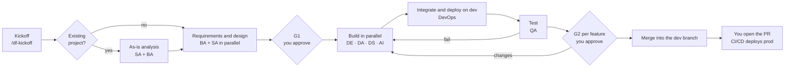

<p align="center">
  
</p>

<p align="center">
  
  
  
  
</p>

---
> 📣 **Built on official Databricks tooling**
>
> DeltaForce does not reinvent Databricks knowledge. The installer retrieves the **Databricks agent skills** from
> [databricks/databricks-agent-skills](https://github.com/databricks/databricks-agent-skills) through the Databricks CLI
> (`databricks aitools install`) and the **MCP server of the Databricks AI Dev Kit** from
> [databricks-solutions/ai-dev-kit](https://github.com/databricks-solutions/ai-dev-kit), at pinned versions and inside your project.
> DeltaForce adds what a delivery team needs around them: roles, process, gates, guardrails, audit and a live monitor.
---

**You describe what you need** — a new data product, or a change to a project that already exists — and a team of nine specialized Claude Code agents analyses, designs, builds, tests and deploys it on Databricks. You approve the design and every feature; the team does the rest and asks you only when something needs your decision.

> **Status**: installer, agents, process, guardrails and audit, existing projects, monitor — implemented and validated end to end on a Databricks workspace. What comes next: [docs/roadmap.md](docs/roadmap.md). Architecture and process: [docs/design.md](docs/design.md).

## Get Started

| Option | Best for | Start here |
|---|---|---|
| :star: [**Install into a project**](#quick-start) | **Start here!** A new folder or an existing Databricks repository, from the VS Code terminal, with one command | [Quick Start](#quick-start) |
| [**Work with the team**](#work-with-the-team) | Kickoff, approvals, changes: the five commands you use as Product Owner | [Commands](#commands) |
| [**Watch the team**](#watch-the-team) | See who is working on what, the backlog, the tests and the workflow in your browser, without spending tokens | [Monitor](#watch-the-team) |
| [**Update or remove**](#update-reconfigure-or-remove) | Keep DeltaForce current in a project | [Update](#update-reconfigure-or-remove) |

---

## AI-Assisted Delivery on Databricks

<table>
<tr>
<td width="50%" align="center" valign="top">

<br>


<br><br>

**Decide what to build — and approve it**

Describe the request at kickoff, approve the design and the feature list (**G1**), validate every delivered feature with its test evidence (**G2**), ask for changes at any time. A person — you — opens the pull request to production.

</td>
<td width="50%" align="center" valign="top">

<br>


<br><br>

**Analyse, design, build, test and deploy on dev**

A Project Manager coordinates eight specialists who work in parallel, each in its own git branch: requirements and architecture documents, pipelines, dashboards, models and agents declared in a Databricks Asset Bundle, deployed and tested on the dev workspace.

</td>
</tr>
</table>

---

## What Can the Team Build?

- **Lakeflow Declarative Pipelines** — ingestion and bronze → silver → gold, Auto Loader, data quality expectations
- **Databricks Jobs** — refresh workflows, multi-task jobs, data quality test jobs
- **AI/BI Dashboards, Metric Views and Genie spaces** — KPIs and analytics on gold
- **Unity Catalog objects** — schemas, tables, volumes, inside the dev catalog
- **ML models** — features, training and evaluation with MLflow, registration in Unity Catalog
- **GenAI** — document processing, vector search, RAG and agents, evaluation, model serving, Databricks Apps
- **Extensions of existing projects** — the team first analyses the codebase and what is deployed, then designs the change

Every resource is declared in the **Databricks Asset Bundle** with parametric names (`${var.catalog}`, `${var.schema_gold}`, …) and follows the **medallion** layers.

---

## Meet the Team

| Role | What it does | Databricks skills it uses |
|---|---|---|
| **Project Manager** | The only one who talks to you. Plans, delegates, tracks backlog and state, runs the gates | `databricks-core` |
| **Solution Architect** | Designs the solution — medallion flows, tables, bundle layout — and checks the work follows it | `databricks-dabs`, `databricks-unity-catalog`, `databricks-metric-views`, `databricks-docs` |
| **Business Analyst** | Business objectives, expected value, requirements, acceptance criteria | `databricks-data-discovery` |
| **Data Engineer** | Ingestion and bronze, silver, gold pipelines and jobs | `databricks-pipelines`, `databricks-jobs`, `databricks-dabs`, `databricks-lakeflow-connect`, `databricks-spark-structured-streaming` |
| **Data Analyst** | Gold marts, metric views, AI/BI dashboards, Genie spaces | `databricks-dbsql`, `databricks-aibi-dashboards`, `databricks-metric-views`, `databricks-data-discovery` |
| **Data Scientist** | Exploration, features, ML training and evaluation | `databricks-ml-training`, `databricks-synthetic-data-gen`, `databricks-python-sdk` |
| **AI Engineer** | Vector search, agents, AI functions, evaluation, serving, apps | `databricks-agent-bricks`, `databricks-vector-search`, `databricks-model-serving`, `databricks-mlflow-evaluation`, `databricks-ai-functions`, `databricks-apps-python` |
| **QA Engineer** | Data quality, integration and regression tests on the deployed feature | `databricks-dbsql`, `databricks-mlflow-evaluation`, `databricks-synthetic-data-gen` |
| **DevOps Engineer** | The only one who integrates, deploys to dev and merges into the dev branch; owns CI/CD | `databricks-dabs`, `databricks-jobs`, `databricks-pipelines` |

Every role also gets `databricks-core`, its own list of Databricks MCP tools, and the DeltaForce process skills (engineering standards, git flow, hand-offs, testing, backlog).

---

## Architecture

<p align="center">
  
</p>

- **Agents in Claude Code.** Every session in the project starts as the Project Manager, who delegates to the specialists — several at once when their work is independent, each in its own git worktree and branch.
- **Everything is in files.** Request, Functional Analysis, Architecture, backlog, task reports, review reports and project state live in `.deltaforce/`, committed with the code. Close Claude Code at any time: the next session continues from there.
- **Guardrails, not just instructions.** Hooks check every action of every agent before it runs, also in auto mode, and every Databricks call, command and blocked action is audited with the role that made it.

### Where the Databricks Skills and Tools Come From

| Source | What the team gets | How DeltaForce installs it |
|---|---|---|
| [databricks/databricks-agent-skills](https://github.com/databricks/databricks-agent-skills) | The official **Databricks agent skills** — pipelines, jobs, bundles, SQL, Unity Catalog, dashboards, ML, vector search, serving, apps — the union of what the enabled roles need | `databricks aitools install --path .claude/skills` with the project's own Databricks CLI (pinned **v1.16.1**) |
| [databricks-solutions/ai-dev-kit](https://github.com/databricks-solutions/ai-dev-kit) | The **Databricks MCP server**: 40+ tools to run SQL, explore Unity Catalog, follow job and pipeline runs, query vector indexes and serving endpoints, ask Genie | Sparse clone of `databricks-mcp-server` and `databricks-tools-core` at **v0.2.0** into `.deltaforce/runtime/ai-dev-kit`, own Python environment, registered in `.mcp.json` as `databricks` (and `databricks-prod`, read-only, when production is configured) |
| [Databricks CLI](https://docs.databricks.com/aws/en/dev-tools/cli/) | Sign-in, bundle validate / deploy / run | Downloaded into `.deltaforce/bin`; the project profile lives in `.deltaforce/.databrickscfg` |
| This repository | The nine agents, the process skills and your commands, the guardrail and audit hooks, the monitor | Rendered into `.claude/` and `.deltaforce/` from the role catalog |

Versions are pinned in [`lib/data/versions.env`](lib/data/versions.env); each role's skills and MCP tools in [`lib/data/roles.yaml`](lib/data/roles.yaml).

---

## Quick Start

### Prerequisites

| On your machine | Notes |
|---|---|
| Windows 10/11 | macOS and Linux are planned |
| [VS Code](https://code.visualstudio.com/) (or another IDE with an integrated terminal) | The whole installation happens in its terminal |
| [Git for Windows](https://git-scm.com/download/win) | Provides the `bash` that runs the installer |
| [Claude Code](https://code.claude.com/docs) | Checked by the installer, not installed |
| Access to `github.com` | DeltaForce, uv, the Databricks CLI, Python and the AI Dev Kit are downloaded from there |

| On Databricks | Notes |
|---|---|
| A workspace | Sign-in with OAuth (browser), a personal access token or a service principal |
| A SQL warehouse | Chosen from a list during installation |
| A dev **catalog** | The installer creates the dev schemas in it if missing |

No administrator rights and nothing global: the installer brings its own uv, Databricks CLI and Python. Keep the project on a **short path** (≤ 140 characters, e.g. `C:\Users\<you>\Projects\my-project`) and **outside OneDrive** — the runtime is several hundred MB.

### Install in a project

Open the project folder in VS Code (**File → Open Folder…**), open **Terminal → New Terminal** and paste one command. The lines are short on purpose, so they survive copy and paste: paste them all at once.

#### Windows — PowerShell (VS Code default)

```powershell
& "$env:ProgramFiles\Git\bin\bash.exe" -c '
d=.deltaforce/framework
u=https://github.com/alessandro9110/deltaforce-ai
test -d $d || git clone -q --depth 1 $u $d
bash $d/install.sh'
```

#### Windows — Git Bash

```bash
d=.deltaforce/framework
u=https://github.com/alessandro9110/deltaforce-ai
test -d $d || git clone -q --depth 1 $u $d
bash $d/install.sh
```

**Next steps:** answer the questions in the terminal — when a question shows `[Enter = value]`, Enter keeps that value. If Claude Code is open on the project, the installer asks you to close it first. The first run takes a few minutes. Command Prompt cannot take multi-line commands (its prompt has no `PS` in front): switch the terminal to PowerShell or Git Bash. The repository is private: the first time, Git may ask you to sign in to GitHub.

<details>
<summary><strong>Installer options</strong> (click to expand)</summary>

Add them after `install.sh`, e.g. `bash .deltaforce/framework/install.sh --dry-run`:

| Option | Effect |
|---|---|
| `--dry-run` | Ask the first questions, print the plan, change nothing |
| `--advanced` | Also ask team options: enabled roles, default model, subagent nesting depth, AI Dev Kit version |
| `--doctor` | Only run the readiness checks |
| `-y`, `--yes` | Skip the confirmations |
| `--non-interactive` | Never prompt; reuse the existing configuration (or `DF_*` environment variables) |
| `-h`, `--help` | Show the help |

</details>

<details>
<summary><strong>What the installer asks</strong> (click to expand)</summary>

**Project** — project name (defaults to the folder name); protected branches the team never pushes to (default `main,master`); the dev branch the team works on (default `dev`); CI/CD provider.

**Databricks workspace** — workspace URL (a URL copied from the browser works too: only the host is kept); CLI profile name (default `deltaforce-<project>`, `DEFAULT` is not allowed); authentication: **OAuth** (recommended, a browser window opens), personal access token or service principal (hidden input).

**Production workspace (optional)** — answer *Yes* when some source data exists only in production: URL, profile, authentication and the SQL warehouse for read queries. On production the team can only read, and every access is audited.

After **Proceed?** the installer checks out the dev branch (offering to create and push it), downloads the tools and signs you in. Then, from lists read from your workspace:

**Dev target** — the bundle target the team deploys to (`dev`; asked only when the project's own bundle names its development target differently); SQL warehouse; compute (serverless recommended, or a cluster); dev catalog (must exist); medallion layout — one schema with `bronze_`/`silver_`/`gold_` prefixes, or one schema per layer; schema names (created if missing). They are the starting point: the team adds the schemas and tables the solution needs inside the dev catalog.

Answers from a previous installation are offered as defaults. Finally the installer writes the configuration, installs everything, offers to **commit the files it installed** (agents cannot change or commit them) and runs the readiness checks.

</details>

### Check that everything is ready

The installer ends with the readiness checks: configuration, Claude Code, git and the dev branch, tool versions, Databricks sign-in, warehouse or cluster, catalog and schemas, MCP server, skills, generated files, a self-test of the guardrails, and `bundle validate -t dev` (warning only). `/df-kickoff` starts only when they pass. To run them again:

```powershell
& "$env:ProgramFiles\Git\bin\bash.exe" -c 'bash .deltaforce/framework/install.sh --doctor'
```

---

## Work With the Team

Open the project in VS Code and start Claude Code: the session starts as the **Project Manager**. Talk to it in plain language, and use the commands below at the decisive moments.

### Commands

| Command | When |
|---|---|
| `/df-kickoff [what to build or change]` | Start the project: the PM checks whether the repository already holds a project, asks what to build or change, known table names, your rules on existing data and the client conventions, then the team starts |
| `/df-status` | Where the project stands and what is waiting for you |
| `/df-approve` · `/df-approve F-001 [notes]` | Approve the design and the feature list (G1) · approve a delivered feature (G2) |
| `/df-changes [F-001] <what to change>` | Changes to the design at G1; to a feature under review (it goes back to the team); to a feature already done (a *change feature* linked to it, with its own G2); or, without an id, to the request |
| `/df-conventions [rule]` | Show or change the rules for all the work: deploy folder, naming, tags, code style, rules on existing data |
| `/clear`, then *continue* | A fresh conversation at clean points — the PM tells you when; it keeps token use low |

The Claude Code status line shows the project, the monitor link and your commands — led by the one to use now, e.g. `Your turn: /df-approve F-004 or /df-changes F-004 <what to change>`.

### How a project runs



1. **Kickoff** — you describe what to build, or what to change in an existing project.
2. **As-is analysis** (existing projects) — the Solution Architect analyses the codebase and what is deployed, the Business Analyst what the solution does; conventions and bundle variables they find come to you for confirmation. Your rules on existing data — e.g. *existing tables are never dropped, except Auto Loader tables for a refresh* — bind the whole team.
3. **Requirements and design** — the **Functional Analysis** and the **Architecture**, in English and Markdown, versioned, with a feature list and dependencies.
4. **G1** — you approve, or ask for changes.
5. **Delivery** — independent features in parallel (up to three); specialists work in their own branches, the DevOps Engineer integrates and deploys to dev, the QA Engineer tests.
6. **G2** — you validate each feature with its review report: what was built, Databricks objects, destructive operations, test and regression evidence. Approved features are merged into the dev branch.
7. **Handover** — a person opens the pull request to the protected branch; CI/CD deploys to production.

**See the work in progress** — the code currently deployed on dev is in `.deltaforce/review/`: add that folder to your VS Code workspace once. **Close Claude Code at any time** — the next session continues from `.deltaforce/`.

---

## Watch the Team

The **monitor** opens in your browser the first time the team starts working in a session. It runs on your computer, only reads `.deltaforce/`, and **uses no tokens**.

<p align="center">
  
</p>

<table>
<tr>
<td width="50%" valign="top">

<p align="center"><strong>Backlog</strong> — every feature with its description, dependencies, acceptance criteria and tasks</p>
</td>
<td width="50%" valign="top">

<p align="center"><strong>Feature</strong> — what it is, acceptance criteria, test evidence, tasks, path and activity</p>
</td>
</tr>
<tr>
<td width="50%" valign="top">

<p align="center"><strong>Workflow</strong> — handoffs, work sent back, deploys, tests, phases and your involvement</p>
</td>
<td width="50%" valign="top">

<p align="center"><strong>Timeline</strong> — who worked when, who asked them, and the result</p>
</td>
</tr>
</table>

- **Now** — a short description of the project, what the team is doing and what is waiting for you.
- **Team** — every agent with what it is doing; click one for its tasks and recent actions.
- **Features** — board or backlog; click a task for what the agent was asked, who worked on it and its report.
- **Documents** — Functional Analysis, Architecture and reports, rendered.
- Always one click away: the link is in the Claude Code status line. From a terminal: `bash .deltaforce/bin/df monitor`. To keep it from opening by itself: `DELTAFORCE_MONITOR=off`.

---

## Guardrails

Hooks check every action of every agent before it runs, also in auto mode. Whatever an agent is asked to do:

| The team can | The team cannot |
|---|---|
| Read and query data on dev, and read production when configured | Write outside the dev catalog, or do anything but read on production |
| Create schemas, tables, jobs, pipelines, dashboards, models and endpoints — through the asset bundle | Create, change or delete Databricks resources by hand, or run `bundle destroy` |
| Deploy and run the bundle on the dev target (the DevOps Engineer only) | Deploy to production, push to protected branches, force-push or rewrite history |
| Commit and push feature and task branches; merge approved features into the dev branch | Change Unity Catalog grants, sharing, connections or storage |
| Extend an existing project, following its conventions and your rules on existing data | Change what DeltaForce installed — agents, skills, settings, framework — or read the credentials |

A blocked action shows up as `DeltaForce guardrail: <reason>` and is recorded in `.deltaforce/audit.jsonl`. Static deny rules in `.claude/settings.json` back up the hooks, and the readiness checks run a self-test.

<details>
<summary><strong>Blocked actions in detail</strong> (click to expand)</summary>

| Area | Blocked |
|---|---|
| Dev workspace | Creating, changing or deleting Databricks resources outside the asset bundle; writes outside the dev catalog; SQL writes that do not name the catalog; permission, sharing, connection and storage changes |
| Production workspace | Anything but reads: SQL other than `SELECT`/`WITH … SELECT`/`SHOW`/`DESCRIBE`/`EXPLAIN`, code execution, jobs, pipelines, Unity Catalog changes, any Databricks CLI call to production |
| Deployments | `bundle deploy` and `bundle run` by anyone but the DevOps Engineer or to a target other than dev; `bundle destroy` |
| Git | Pushes to protected branches, force pushes, remote branch deletions, pushing `df/integration`, `reset --hard`, `rebase`, merges into the dev branch by anyone but the DevOps Engineer |
| Files | Changes to anything DeltaForce installed, including commits that contain it; changes to the client conventions by anyone but the PM; any access to the credentials file and its backups |

</details>

---

## Update, reconfigure or remove

**Update** — with Claude Code **closed** (the installer checks and asks), run the install command again. It updates `.deltaforce/framework`, offers your answers as defaults and refreshes everything. The team's work — documents, backlog, reports, state, code, tests, bundle resources, data — is never touched.

```powershell
& "$env:ProgramFiles\Git\bin\bash.exe" -c 'git -C .deltaforce/framework pull && bash .deltaforce/framework/install.sh'
```

**Another team member** — after cloning the project, run the same install command: it downloads the framework and tools, signs in with their own account and regenerates the machine-specific files.

<details>
<summary><strong>Remove DeltaForce from a project</strong> (click to expand)</summary>

There is no uninstall option yet. In Git Bash:

```bash
rm -rf .deltaforce/framework .deltaforce/bin .deltaforce/runtime .deltaforce/.databrickscfg* .deltaforce/status.json .mcp.json .claude/settings.local.json
```

To remove it completely, also delete `.deltaforce/`, the `.claude/skills/databricks-*` folders, the `deltaforce` blocks in `CLAUDE.md` and `.gitignore`, and `resources/deltaforce.variables.yml`.

</details>

---

## Reference

<details>
<summary><strong>What gets installed and where</strong> (click to expand)</summary>

| Path | Content | In git? |
|---|---|---|
| `.deltaforce/framework/` | DeltaForce AI itself | ignored |
| `.deltaforce/config.yaml` | Your answers, no secrets | committed |
| `.deltaforce/conventions.yaml` | Client conventions, rules on existing data | committed |
| `.deltaforce/requirements/`, `architecture/`, `backlog/`, `reports/`, `state.yaml`, `events.jsonl` | The team's documents and progress | committed |
| `.deltaforce/.databrickscfg` | Databricks CLI profile (and token or secret for PAT or service principal); backups are deleted and ignored | ignored |
| `.deltaforce/bin/` | uv, the Databricks CLI, the `df` helper | ignored |
| `.deltaforce/runtime/` | Python, AI Dev Kit MCP server and its environment, guard policy, agent activity, monitor state | ignored |
| `.deltaforce/audit.jsonl`, `status.json` | Audit trail · result of the last readiness check | ignored |
| `.claude/agents/` | The DeltaForce agents | committed |
| `.claude/skills/df-*` · `.claude/skills/databricks-*` | DeltaForce skills and your commands · Databricks agent skills | committed |
| `.claude/settings.json` | Sessions start as the PM, MCP approval, subagent nesting, deny rules | committed |
| `.claude/settings.local.json` | Project profile for every command, guardrail and audit hooks, status line | ignored |
| `.mcp.json` | The `databricks` MCP server (and `databricks-prod`) with this machine's paths | ignored |
| `CLAUDE.md` | A *DeltaForce project context* block | committed |
| `databricks.yml`, `resources/deltaforce.variables.yml` | Bundle skeleton (created only if missing) · dev values of the bundle variables (existing variables are not redefined) | committed |
| `.gitignore` | A managed block for the machine-specific files | committed |

Content you write yourself in `CLAUDE.md`, `.gitignore` and `.claude/settings.json` is preserved. With OAuth, the Databricks CLI keeps its tokens in its own cache under your user profile — the only thing outside the project.

</details>

<details>
<summary><strong>Terminal commands and environment variables</strong> (click to expand)</summary>

Commands for **Git Bash**, from the project root. From PowerShell wrap them: `& "$env:ProgramFiles\Git\bin\bash.exe" -c '<command>'`; from Command Prompt: `"%ProgramFiles%\Git\bin\bash.exe" -c "<command>"`.

| Command | What it does |
|---|---|
| `bash .deltaforce/framework/install.sh` | Update and reinstall, keeping your answers — with Claude Code closed |
| `bash .deltaforce/framework/install.sh --doctor` | Readiness checks only |
| `git -C .deltaforce/framework pull` | Download the latest DeltaForce by hand |
| `bash .deltaforce/bin/df monitor` | Start the monitor and open it (`--no-open` prints the address, `--stop` stops it) |
| `bash .deltaforce/bin/df validate` | Check state, backlog, events and conventions |
| `bash .deltaforce/bin/df events '[...]'` | Record lifecycle events — used by the team |
| `.deltaforce/bin/databricks <command>` | The project's Databricks CLI, e.g. `bundle validate -t dev` |

| Variable | Effect |
|---|---|
| `DELTAFORCE_MONITOR=off` | The monitor does not start or open by itself |
| `DF_REPO_URL`, `DF_REF` | Repository and branch the installer downloads DeltaForce from |

</details>

<details>
<summary><strong>Troubleshooting</strong> (click to expand)</summary>

| Symptom | Fix |
|---|---|
| `...\Git\bin\bash.exe ... is not recognized` | Git for Windows is missing or elsewhere: install it, or use your `bash.exe` path |
| `DeltaForce guardrail: …` in the conversation | An agent tried a blocked action; the team reports it instead of working around it. If the action is legitimate, a person does it |
| `Could not download https://github.com/...` | Check access to the DeltaForce repository and sign in to GitHub when Git asks |
| `The repository path is N characters and Windows long paths are disabled` | Move the project to a shorter path (≤ 140 characters), or enable `LongPathsEnabled` |
| `Run the installer from the repository root` | Open the repository's root folder in VS Code |
| `Could not create the initial commit` | Set your git identity: `git config --global user.name` and `user.email` |
| `Ignoring DATABRICKS_HOST, ...` warning | Remove those variables from your environment: they override the project profile |
| OAuth browser window does not open | Copy the URL printed in the terminal into your browser |
| Authentication, catalog or schema check fails | Run the install command again and sign in or pick existing objects; or ask an administrator |
| The PM warns that `.deltaforce/.databrickscfg.bak` is not ignored | A CLI backup left by an older version: re-run the installer with Claude Code closed |
| `Failed to create virtual environment ... Access is denied. (os error 5)` | Something still uses the project's Python — usually Claude Code: close it and run the installer again |
| The monitor page does not open | `bash .deltaforce/bin/df monitor`; if it fails, see `.deltaforce/runtime/monitor.log` and re-run the installer |
| `databricks bundle validate` warning | Not blocking: `.deltaforce/bin/databricks bundle validate -t dev` shows the details |
| Downloads fail | Check access to `github.com`, also through a corporate proxy |

</details>

---

## Developing DeltaForce AI

For contributors: commands, layout and conventions in [CLAUDE.md](CLAUDE.md); architecture, process and decisions in [docs/design.md](docs/design.md); what exists and what comes next in [docs/roadmap.md](docs/roadmap.md).

Built on [Claude Code](https://code.claude.com/docs), the [Databricks agent skills](https://github.com/databricks/databricks-agent-skills), the [Databricks AI Dev Kit](https://github.com/databricks-solutions/ai-dev-kit) and [Databricks Asset Bundles](https://docs.databricks.com/aws/en/dev-tools/bundles/).
