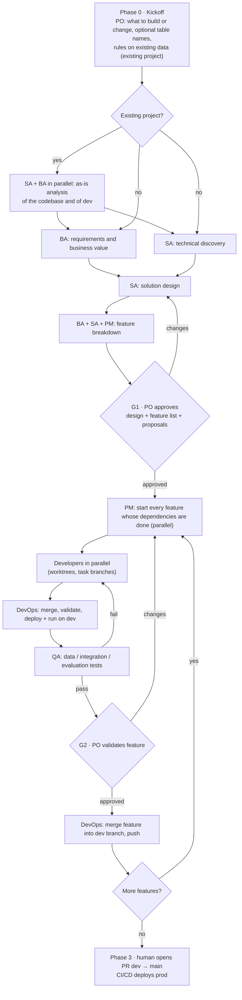

# DeltaForce AI — Design

Status: **Draft v0.1** · 2026-09-14 · design agreed in discussion with the maintainer, no code yet.

## 1. Goal

DeltaForce AI is an installable Claude Code framework that gives a project repository a team of specialized agents able to design, build, test and deploy on Databricks — data engineering, analytics, data science, ML and GenAI.

It is installed from GitHub with `install.sh` into a **target project repo**, configured through a config file, and wires up the Databricks AI tooling (agent skills + MCP server) so the team can operate against a real Databricks workspace.

## 2. Constraints and decisions

| Topic | Decision |
|---|---|
| Agent runtime | Claude Code only |
| Install scope | **Project only, never global**: skills, MCP server, ai-dev-kit runtime and Claude Code config all live inside the target repo |
| Team OS | Windows (installer and hooks run under Git Bash); CI runners are Linux |
| Deployment unit | Databricks Asset Bundles (DABs): **every** Databricks resource is declared in the bundle and deployed by the DevOps Engineer; MCP tools are only for reading, querying and running, and their create/update/delete actions are blocked by hooks |
| Prod deployment | Only through CI/CD — Azure DevOps now, GitHub Actions later |
| Language | Agent prompts, templates and repo docs in English |
| Data architecture | Medallion (bronze/silver/gold) for every discipline: DE, analytics, ML, AI |
| Parameters | Every environment-specific value (catalog, schemas, table names, endpoints) is a variable |
| Git | Never push to `main`. Work lands in a dev branch. The PR to `main` is opened by a human |
| PO involvement | Approves design + feature list once (G1), validates **every** feature (G2), and is consulted on blockers or changes to the request |
| Feature cadence | Independent features run in parallel (up to three active); a feature starts when its dependencies are done; the PO validates every feature |
| Backlog | Markdown files in the repo, machine-readable (future monitoring app) |
| Deliverables | Functional Analysis (Business Analyst) and Architecture (Solution Architect): English, Markdown, standard DeltaForce structure, versioned with a *Document control* table (`1.0 — Approved` at G1), under `.deltaforce/`. The repository itself is a deliverable too: the Business Analyst writes the root `README.md` and a README per source folder (*Repository documentation* below) |
| Production data | Production is a separate workspace. Every role that works with data may read from it — SQL queries, model and vector search calls, Genie, table stats — and every access is audited with the role that made it; every other activity on prod is blocked by hooks |

## 3. Two repositories

- **DeltaForce AI (this repo)** — the framework: agent definitions, skills/commands, hooks, templates, installer, schemas.
- **Target project repo** — where the team works. The installer copies templates into it and configures Databricks tooling. All project state (backlog, events, audit) lives here.

## 4. Team

The PO is the human user. The PM is the main Claude Code session (`"agent": "pm"` in the project's `.claude/settings.json`, so every session — terminal or VS Code — starts as the PM); every other role is a subagent in `.claude/agents/`. Each agent is written in `templates/claude/agents/<role>.md` in the Claude Code subagent format — frontmatter (`name`, `description`, `tools`, `model`, `skills`, `isolation`, `color`) and prompt — and rendered by the installer into the project, which adds from `lib/data/roles.yaml` the `Agent(...)` allowlist, the Databricks MCP tools and production reads, and applies the model chosen in the configuration.

| Role (id) | Responsibilities | May | May not |
|---|---|---|---|
| **PM** (`pm`) | Intake, planning, feature sequencing, backlog owner, PO reports and escalations | Read everything, write backlog/state/reports, delegate | Write source code, change Databricks resources |
| **Solution Architect** (`solution-architect`) | End-to-end solution design, medallion flows, table naming proposal, ADRs, bundle layout, design conformance review | Read UC metadata, write `.deltaforce/architecture/` | Write source code, deploy |
| **Business Analyst** (`business-analyst`) | Business objectives, expected value and success metrics; requirements and user stories traced to objectives; acceptance criteria; the repository documentation (root `README.md` and the README of each source folder); functional support to team and PM | Read-only data discovery, write `.deltaforce/requirements/` and the `README.md` files of the repository, git on its own task branches | Write source code, deploy |
| **Data Engineer** (`data-engineer`) | Ingestion, bronze → silver → gold pipelines, jobs | Write `src/pipelines`, run SQL/code on dev, `bundle validate` | Deploy |
| **Data Analyst** (`data-analyst`) | Gold marts, metric views, AI/BI dashboards, Genie spaces; supports QA on data tests | Query dev, write dashboards/metric views | Deploy |
| **Data Scientist** (`data-scientist`) | ML expert: EDA, realistic samples, feature engineering, baselines and model challenges, training and tuning, MLflow, UC registration with champion/challenger aliases, inference, serving, monitoring and retraining code (MLOps), Hugging Face models on Databricks | Run code on dev, MLflow | Deploy, publish to the Hugging Face Hub |
| **AI Engineer** (`ai-engineer`) | GenAI expert: RAG, Vector Search, custom agents and Agent Bricks, evaluation datasets and model challenges, GenAI evaluation, prompts and tracing, serving, apps (AIOps), Hugging Face models on Databricks | Vector Search / serving on dev, create and update Agent Bricks on dev, write `src/ai`, `src/apps` | Deploy, delete Agent Bricks, publish to the Hugging Face Hub |
| **QA Engineer** (`qa-engineer`) | Data quality tests, integration tests, ML/AI evaluation gates with results recomputed independently | Run tests on dev, read everything, write `tests/` | Modify source code |
| **DevOps Engineer** (`devops-engineer`) | Integration: merge task branches, `bundle validate/deploy/run` on dev, CI/CD definitions, push to dev branch | Deploy and run on **dev** only, write `.devops/`, git merge/push | Touch prod, write business code, push to `main` |

### Skills per role

Databricks skills come from `databricks aitools` (official `databricks/databricks-agent-skills`), are listed in each prompt and load on demand; the DeltaForce process skills in the subagent `skills:` frontmatter are preloaded. All roles get `databricks-core`. Hugging Face skills come from the official `huggingface/skills` repository for the Data Scientist and the AI Engineer: always the latest `main`, with the installed commit recorded, and only those whose know-how applies on Databricks — not the Hub CLI, Spaces, ZeroGPU, SageMaker or publishing skills.

| Role | Skills |
|---|---|
| solution-architect | `databricks-dabs`, `databricks-unity-catalog`, `databricks-docs`, `databricks-metric-views` |
| business-analyst | `databricks-data-discovery` |
| data-engineer | `databricks-pipelines`, `databricks-jobs`, `databricks-dabs`, `databricks-lakeflow-connect`, `databricks-spark-structured-streaming` |
| data-analyst | `databricks-dbsql`, `databricks-aibi-dashboards`, `databricks-metric-views`, `databricks-data-discovery` |
| data-scientist | `databricks-ml-training`, `databricks-synthetic-data-gen`, `databricks-python-sdk`, `databricks-execution-compute`, `databricks-model-serving`; Hugging Face: `huggingface-best`, `hf-mem`, `huggingface-datasets`, `train-sentence-transformers`, `trl-training`, `huggingface-llm-trainer`, `huggingface-vision-trainer` |
| ai-engineer | `databricks-agent-bricks`, `databricks-vector-search`, `databricks-model-serving`, `databricks-mlflow-evaluation`, `databricks-ai-functions`, `databricks-apps-python`, `databricks-execution-compute`, `databricks-unstructured-pdf-generation`; Hugging Face: `huggingface-best`, `hf-mem`, `huggingface-datasets`, `train-sentence-transformers`, `trl-training`, `huggingface-llm-trainer` |
| qa-engineer | `databricks-dbsql`, `databricks-mlflow-evaluation`, `databricks-synthetic-data-gen`, `databricks-execution-compute` |
| devops-engineer | `databricks-dabs`, `databricks-jobs`, `databricks-pipelines` |

Default models (overridable in config): `pm` and `solution-architect` on Opus, the other roles on Sonnet.

### Example agent definition

Rendered `.claude/agents/data-engineer.md` (MCP tools shortened):

```markdown
---
name: data-engineer
description: Builds ingestion and bronze, silver and gold pipelines, jobs and the related bundle resources on Databricks, in its own worktree and task branch. Use for data pipeline and data modelling tasks of the current feature.
tools: Read, Grep, Glob, Edit, Write, Bash, Skill, Agent(data-engineer), mcp__databricks__execute_sql, mcp__databricks__execute_code, mcp__databricks__get_table_stats_and_schema
model: sonnet
skills:
  - df-engineering-standards
  - df-git-flow
  - df-handoff
isolation: worktree
color: orange
---
```

## 5. Process



- **Phase 0 — Kickoff** (`/df-kickoff`): the PO states *what the team must build* and provides the elements: catalog, schema(s), optional table names, dev branch. Stored in `.deltaforce/config.yaml` and `.deltaforce/requirements/request.md`.
- **CI/CD from the client's templates**: clients bring their own pipeline templates — a templates repository referenced by the pipeline, files already in the project repository, or CI-only or deploy templates handed over during development. The kickoff records where they are (`cicd` in `.deltaforce/conventions.yaml`: `templates`, `repository`, `ref`, `paths`, `notes`). Unless `project.cicd` is `none`, the feature breakdown includes a **CI/CD feature**, owned by the DevOps Engineer and validated by the PO at G2: the pipeline references the client's templates rather than copying them (Azure DevOps `resources.repositories` and `template:`/`extends`, GitHub reusable workflows), validates the bundle on pull requests, deploys the production target only from the protected branch with a service principal, and passes a `BUNDLE_VAR_` value for every variable without a default. Only when the client has no template, the DevOps Engineer starts from the DeltaForce standard in `templates/cicd/` (Azure DevOps, GitHub Actions) as a proposal. The pipeline files always go in **`.devops/`** at the root of the project repository, also when they only reference the client's templates; GitHub Actions runs workflows, reusable ones included, only from `.github/workflows/`, so there only a trigger workflow stays in `.github/workflows/` and the steps live in a composite action under `.devops/github/`. The production pipeline cannot run locally: the G2 report lists what the client configures before the first run.
- **Environments**: DeltaForce does not assume dev, test and prod. At kickoff the PO declares the client's environments — `environments` in the conventions: purpose, workspace (`dev`, `production`, `other`), production flag, bundle target, catalogs, what the team may do (`deploy`, `read`, `none`), `deployed_by` (`team`, `cicd`), data rules. The SA designs a bundle target per environment and which environment each feature is deployed and tested in; the CI/CD feature deploys the `cicd` environments in the client's promotion order. Access follows one rule: **declarations narrow, only the installer widens**. Deploy access beyond the dev target is written to `config.yaml` (`environments`) only when the PO answers yes for each environment in the installer (non-interactive runs add none; confirmed ones are kept). `df validate` and every install copy the declared environments to `.deltaforce/runtime/environments.json` (`deltaforce/environments.py`), and the hook applies the narrower of the two at once: a `read` or `none` declaration, a different bundle target or an environment removed closes deploys and writes, and catalogs of `none` environments are closed to reads as well. Production is never deployed by the team (schema and hook). First version: environments on the dev workspace; environments on other workspaces are recorded and deployed through CI/CD. Prototyping environments follow the same process (G1, G2) with their own data rules.
- **Changes after delivery**: a feature that is `done` is never reopened. When the PO asks to change it (`/df-changes F-xxx …`), the PM creates a *change feature* with `change_of: F-xxx` and a dependency on it; the Business Analyst writes what changes and what must stay, the Solution Architect the tasks and the impact; it goes through delivery and its own G2. The original keeps its delivery date, and the monitor links the two and counts changes after delivery.
- **Bugs**: a defect found during development — by QA in tests, by the DevOps Engineer in a failed deploy or run, by a builder in another feature's work (*Defects found* in the `df-handoff` report), or by the PO at G2 — is recorded by the PM in the file of the feature where it lives (`bugs` in the feature frontmatter), which may be an earlier feature, `done` ones included. Ids are numbered across the whole backlog (`B-001`, `B-002`, …) so a bug is named without its feature. Each bug has a severity (`blocker` stops the work, `major` gives a wrong result, `minor`), who found it, during what (build, integration, test, G2), the feature being worked on (`found_in`), the evidence and its fix tasks, which may belong to another feature. Status `open → fixing → fixed → verified`; only QA verifies, re-running the test that found it; `wont_fix` only by the PO's decision, in `notes`. A bug in the feature being built is fixed there; in a `done` feature it gets fix tasks in the feature it blocks (the PO is told), or, when it blocks nothing, the PM proposes a change feature. No feature reaches G2 or `done` with a `blocker` or `major` bug found in it or fixed by its tasks still open (`df validate` enforces it); open `minor` bugs are listed in the G2 report and the PO accepts them (they stay open as known limitations, listed in the handover) or sends the feature back. Events `bug_opened` and `bug_status_changed` carry the bug id; the monitor shows open bugs on cards, a bug table in the feature panel (bugs living in the feature and bugs found while building it), bug markers in the timeline and a *Bugs found* tile in the workflow view.
- **Existing projects**: the team is used to extend a working project as well as to build a new one. The kickoff finds product content in the repository (code, bundle resources, tests, CI/CD, a bundle DeltaForce did not create) and the PO confirms; the PO also gives the rules on existing data and objects — for example, existing tables in dev are never dropped, except the Auto Loader tables that are dropped with their checkpoint to refresh them — and what the team must not touch. Everything project-specific is captured there, in `.deltaforce/conventions.yaml` (`project.kind`, `data_rules`, `bundle.variables`), not in extra installer steps or hook rules. Phase 1 then starts with the **as-is analysis**, SA and BA in parallel and read-only: `architecture/as-is.md` (codebase, bundle and the variables that hold catalog and schemas, data on dev and how it is loaded, observed conventions, CI/CD, technical debt) and `requirements/as-is.md` (outputs, business rules found in the code, KPIs, gaps). Conventions and bundle variables found there are confirmed by the PO with the other open questions. Requirements and architecture describe the change (new, changed, unchanged); builders follow the data rules and list every destructive operation in their reports; QA adds regression checks; the G2 report shows destructive operations and regression evidence. The installer does not redefine bundle variables the project already has.
- **Phase 1 — Discovery & design**: in parallel, the BA writes requirements (business objectives, value, success metrics, user stories) and the SA does the technical discovery (data sources, workspace capabilities, architecture options); questions for the PO from both are asked in one round; then the SA designs the full solution (architecture, medallion flows for each discipline, table naming proposal when the PO gave none); BA + SA + PM derive the feature list with dependencies and per-role tasks. **G1**: PO approves once.
- **Phase 2 — Delivery**: the goal is to complete features — one, or several in parallel when they do not depend on each other (up to three active). Per feature: parallel development → integration and dev deploy by DevOps (from the integration branch) → QA → PM feature report → **G2**: PO validates that feature. A feature starts only when its dependencies are done; the team keeps working on other active features while the PO reviews.
- **Repository documentation**: what the team hands over is a repository, not only a set of Databricks objects, so it explains itself. The **Business Analyst** owns the root `README.md` — what the project delivers and for whom, then one section per component in functional language: what a dashboard shows and for which decision, which questions the Genie space answers and which it cannot, what a job produces through which medallion layers and on which trigger, what a model predicts and how good it is against the obvious alternative, what an app is for — and a short `README.md` in every folder under `src/` (and in `.devops/` when there is CI/CD) saying what those resources are for, what each one does, how it was built and where its output lands. The contract is `df-readme`, preloaded by the BA. It is written from the task reports, never by re-reading the code: the root README is created at the feature breakdown (components marked *Planned*), each feature carries a **documentation task** delegated when its build tasks are `ready_for_integration` — a task branch of the feature like any other, so the PO reads the documentation at G2 with the code — and the handover closes it with a final pass. It introduces and links the Functional Analysis and the Architecture rather than repeating them, carries nothing that ages badly (run ids, workspace URLs, per-run numbers), and on an existing project never rewrites the client's README: sections are added and edited in place, as in the Functional Analysis.
- **Escalation** at any time, and only then: blocker, ambiguity, or a change compared to the request.
- **Phase 3 — Handover**: dev branch pushed and CI/CD definitions ready; a human opens the PR to `main`; CI/CD deploys prod.

### Status model

- Feature: `todo → in_progress → integrating → in_test → awaiting_po → done`, plus `blocked`. A G2 rejection moves `awaiting_po → in_progress`. Only a PO decision moves a feature to `done`.
- Timestamps are read from the clock, never written from memory: `df event` stamps events itself, and the state and feature files the PM writes by hand are checked by `df validate`, which rejects any timestamp more than five minutes ahead of now. A run on the sandbox stamped almost every feature up to a day in the future, and the monitor faithfully reported work that had not happened yet.
- Task: `todo → in_progress → ready_for_integration → integrated → done`, plus `blocked`. A task reaches `ready_for_integration` only when its code has run at least once in the context it will run in — on the warehouse for SQL, with `execute_code` or Databricks Connect for Python, or as a one-off `databricks jobs submit` when it must run exactly as a job task. `bundle validate` is not a run, and the deploy is not the first test (`df-testing`).

## 6. Orchestration model

**Decision: subagents as the backbone; agent teams evaluated and kept out of the MVP.**

- PM runs as the main session through the `agent` setting, so hooks see `agent_type: pm` too. Its prompt replaces the default Claude Code system prompt.
- Specialist roles are subagents.
- Subagents are stateless between calls; collaboration happens through repo artifacts (requirements, architecture, backlog) plus the delegation prompt written by the PM.

### Token use

Measured on the first sandbox run (F-001, 19 subagents): the PM main session was the largest consumer — its context grew from 26 k to 247 k tokens and every call re-read it — then Data Engineer and DevOps; 33 of the PM's 63 shell calls were single `df event`/`df validate` commands; the DevOps Engineer polled job runs; builders started at about 32 k tokens of context against 20 k for the Business Analyst, mostly preloaded skills. Rules that follow:

- **Fresh session at clean points**: after G1 and after an approved feature is merged, with no specialist working, the PM tells the PO everything is saved and suggests `/clear` then *continue*; state, backlog and reports are the memory.
- **Batched bookkeeping**: `df events '[...]'` records all events of a change and validates in one call; `state.yaml` is rewritten in one write.
- **No polling**: `bundle run` waits for the run (Bash timeout at maximum, or a background Bash call for long runs); related git commands are chained in one call.
- **Lean preloads**: every preloaded skill is in every call's context. The PM preloads `df-backlog` and `df-handoff`; builders preload `df-engineering-standards`, `df-git-flow`, `df-handoff`; `df-testing` is preloaded only by the QA Engineer and loaded on demand by the others; `df-bi`, `df-pipelines`, `df-mlops` and `df-aiops` are always loaded on demand, by the Data Analyst, the Data Engineer, the Data Scientist, the AI Engineer, the Solution Architect and the QA Engineer. Inside a skill the same rule applies again: `SKILL.md` holds what is needed on every task, `references/*.md` what is needed sometimes, and the skill says when to read each one — `df-engineering-standards` went from 160 preloaded lines to about 100 that way.
- Measure again after each change on a real run; the model of the PM (Opus or Sonnet) is a PO decision.

Second measurement (change feature F-005 on the updated version, one session): PM context peaked at 159 k tokens (MVP sessions: 247 k, 192 k, 277 k) and the PM's share of cost fell to 38% (MVP: 37–48%, rising); the PM used 11 `df events` calls and no single `df event`/`df validate` (MVP first session: 20 + 13); the DevOps Engineer made 27 calls with no run polling (MVP sessions: 130, 43, 95); `/clear` was suggested at the close. The largest remaining cost was the Solution Architect updating design documents for a small change (25% of the session) — next lever: change features update only the affected sections of the Functional Analysis and the Architecture. Applied: for changes to delivered work, the Business Analyst and the Solution Architect find the affected sections with Grep, edit them in place with one *Document control* row, and never rewrite or re-read the whole document; after a change feature the PM updates `handover.md` with that feature only and does not ask for a second round of document updates when the change already made them.

### Nested delegation

Subagents may spawn other subagents. Nesting depth comes from `orchestration.max_spawn_depth` in config (default `3`, Claude Code's own default), written to `CLAUDE_CODE_MAX_SUBAGENT_SPAWN_DEPTH`. Who may spawn whom is restricted per role with the `Agent(<agent_type>)` syntax in the `tools` frontmatter:

| Role | May spawn | Typical use |
|---|---|---|
| pm | every role | normal delegation of phase and feature work |
| solution-architect | data-engineer, data-analyst, data-scientist, ai-engineer, Explore | discipline feasibility checks while designing |
| business-analyst | data-analyst, Explore | data discovery to ground requirements |
| data-engineer | data-engineer | parallel sub-tasks (e.g. bronze, silver, gold of one task) |
| data-scientist | data-scientist, data-analyst | parallel experiments, EDA support |
| ai-engineer | ai-engineer, data-engineer | parallel RAG components, document ingestion pipeline |
| qa-engineer | data-analyst | data test support: profiling, reconciliation queries |
| devops-engineer | none | single integrator, never delegates |

Rules:

- A parent integrates its children's work into its own task branch before reporting. DevOps still sees exactly one branch per backlog task.
- Consultations (e.g. SA → data-engineer feasibility check) produce findings, not branches. DevOps only merges branches listed in the backlog.
- Children report to their parent, parents report to the PM. The PM stays the only backlog writer.
- Guardrails apply at every level: hooks see the child's own `agent_type`, so a data-engineer spawned by the SA still cannot deploy.
- Token cost grows with depth and fan-out. Lower the depth in config if cost becomes an issue.

### Agent teams — evaluation (Claude Code docs, v2.1.2xx)

Agent teams (`CLAUDE_CODE_EXPERIMENTAL_AGENT_TEAMS=1`) run teammates as independent sessions with a shared task list and direct messaging. Reasons they don't fit delivery today:

- **Experimental**; in-process teammates are **not restored by `/resume`** — a project spans days and waits on PO gates.
- The shared task list lives in `~/.claude/tasks/<team>/` (user-local), not in the repo — conflicts with the repo backlog as single source of truth and with the monitoring app.
- Subagent `skills:` are **not applied to teammates** — per-role Databricks skill preloading is lost.
- Teammates inherit the lead's permission mode; no per-teammate mode at spawn; permission prompts bubble to the lead.
- Split panes are not supported in Windows Terminal (in-process mode only).
- Significantly higher token usage.
- When enabled, any subagent Claude names launches as a teammate — so the flag stays off by default.

**Where they could add value**: Phase 1 cross-discipline design review, with SA, DE, DS and AI Engineer challenging the design in parallel. `TaskCreated`, `TaskCompleted` and `TeammateIdle` hooks can act as quality gates there. Planned as an opt-in experiment (roadmap M6).

## 7. Git and branching

- The PO provides the **dev branch** (e.g. `dev` or `dev/customer-360`). The main checkout sits on it. `main` is only for prod / CI/CD triggers.
- The main checkout stays on the dev branch. The PM creates each feature branch `df/F-003` from the dev branch without checking it out, so several features can be active at once.
- Builder subagents use `isolation: worktree`. Project settings set `worktree.baseRef: "head"` (the default `"fresh"` branches from the remote default branch, `main`); each specialist then creates its task branch with an explicit start point: `git switch -c df/F-003-<role>-T<n> df/F-003`.
- Task branches are pushed to the remote for traceability.
- Worktrees contain only committed files. The kickoff commits the installer output (agents, skills, settings, bundle files, config) together with the request, and gate commits keep docs and backlog on the dev branch. Delegation prompts give requirements, design, backlog and conventions as absolute paths in the main checkout, since the PM updates them there during delivery.
- **Integration branch**: the dev target holds one bundle deployment, so deploying feature branches one after another would remove each other's resources. The DevOps Engineer rebuilds a local `df/integration` = dev branch + every active, integrated feature, and deploys that. It is never pushed. It lives in the gitignored worktree `.deltaforce/review/`, where all integration happens, so the main checkout never leaves the dev branch and the PO can open the deployed code before G2. When a feature is closed, the DevOps Engineer removes unused agent worktrees and `worktree-agent-*` branches.
- DevOps merges task branches into their feature branch, and after G2 merges the feature into the dev branch, pushes, and rebuilds the integration branch. The dev branch only contains PO-validated features.
- Commit trailers: `DeltaForce-Role: <role>` and `DeltaForce-Task: F-003/T-003.1`.
- Guard hook blocks: push to `main`/`master` (configurable protected list), force push, `reset --hard` on the dev branch, remote deletion of the dev branch.

```json
{
  "env": {
    "CLAUDE_CODE_MAX_SUBAGENT_SPAWN_DEPTH": "3",
    "CLAUDE_CODE_EXPERIMENTAL_AGENT_TEAMS": "0"
  },
  "worktree": { "baseRef": "head" }
}
```

## 8. Databricks conventions

### Parameters

- Config values become DABs variables: `catalog`, `schema_bronze`, `schema_silver`, `schema_gold`, and one variable per table.
- Medallion layout is configurable: `single_schema` (layer prefix on table names, default when the PO gives one schema) or `multi_schema` (one schema per layer).
- Schema and table names: PO-provided at kickoff — where the PO also says which schema holds what, for instance registered models, feature tables and predictions — or proposed by the SA and approved at G1. A schema beyond the ones the installer configured is listed in the Architecture with what it holds and confirmed by the PO at G1. Either way names are stored in config and generated into `resources/variables.yml`.
- **The dev catalog is the boundary, the installer's schemas are the starting point.** The team is free to create further schemas and tables inside the dev catalog when the solution needs them, as long as they are consistent with what is being built: they follow the medallion layers, are described in `.deltaforce/architecture/`, and are declared as bundle resources with variables (never created by hand). New objects coherent with the approved design need no PO escalation; objects that change the request do.
- Dev target uses `mode: development`; prod target uses `mode: production` with values injected by CI/CD (`BUNDLE_VAR_<name>`) and a service principal.
- No literal catalog/schema/table names in source: enforced by a hook on edits under `src/` and by QA review.
- **Descriptions are mandatory**: every object the team creates on Databricks — schemas, tables, views and their columns, volumes, functions, registered models and versions, indexes, endpoints, jobs, pipelines, dashboards, Genie spaces — carries a description of what it holds or does (`COMMENT`, `comment`/`description` in bundle resources, the description argument of an MCP or MLflow call). The Architecture states it with each object, the builders write it, QA checks it as a data quality test.
- **Experiments live in MLflow**: exploration, training, tuning and every ML or GenAI evaluation is an MLflow run in the project's experiment, with parameters, metrics, data and prompt versions, model and artifacts. A number that is not in an MLflow run is not reported — not from a notebook cell, a log or a printed output.

### Medallion across disciplines

| Layer | Data engineering / analytics | ML | GenAI |
|---|---|---|---|
| Bronze | Raw ingested data, raw files in volumes | Raw training sources | Raw documents (PDF, HTML) in volumes |
| Silver | Cleaned, conformed, deduplicated | Cleaned training data | Parsed and chunked documents |
| Gold | Business aggregates, marts, metric views | Feature tables, inference outputs | Vector index source tables, evaluation datasets |

UC assets follow the same parameters: models `${var.catalog}.${var.schema_gold}.<model>`, vector indexes on gold, serving endpoint and app names suffixed per target.

- **BI lifecycle** (`df-bi`): analytics strategy in the Architecture → gold modelled for the question → one definition per KPI in a metric view → dashboard for known questions, Genie space for the others, curated with instructions, examples and descriptions → an expected-question set. QA recomputes the measures from gold and re-runs the questions independently.
- **ML lifecycle** (`df-mlops`): ML operations strategy in the Architecture → realistic samples from dev → gold feature tables → splits without leakage → baseline → model challenge with a leaderboard in MLflow → UC registration with `challenger` and `champion` aliases → validation before promotion → batch inference or serving → monitoring and retraining. QA recomputes the metrics independently.
- **AI lifecycle** (`df-aiops`): AI operations strategy → bronze documents → silver parse/chunk → gold vector index and versioned evaluation dataset → baseline and challenge between models, retrieval and prompts → agent (custom or Agent Bricks) with Prompt Registry and tracing → MLflow evaluation → serving or app behind AI Gateway → monitoring. QA runs the evaluation independently.

**Decisions on ML and GenAI (2026-09-15)**:

- The Data Scientist and the AI Engineer are the team's ML and GenAI experts. The ML or AI operations strategy is designed with them before G1 and recorded in section 8 of the Architecture. No separate ML Engineer role: the Data Scientist writes the MLOps code (training, validation, inference, monitoring and retraining jobs), the DevOps Engineer deploys it.
- Realistic data comes from the dev catalog; production data only when the configuration or the kickoff request asks for it. Synthetic data only for edge cases and transformation tests.
- Every model choice is a challenge against a baseline, with a leaderboard at G2; the approved result is the baseline later changes must beat.
- Hugging Face models are chosen, fine-tuned, registered and served on Databricks. Publishing to the Hugging Face Hub, Hugging Face Jobs, Spaces and Inference Endpoints are blocked by the hook: models, data and training stay on Databricks.
- Agent Bricks (Knowledge Assistants, Supervisor Agents) cannot be declared in the bundle: the AI Engineer creates and updates them on dev with the MCP tools, keeps each definition in `src/ai/agent_bricks/`, and the G2 report lists them as created outside the bundle; deleting one needs a person. Not available on Free Edition, so validated by hook tests only.
- `databricks-ai-runtime` (experimental, needs the separate `air` CLI) is not installed for now.

### Target project layout

```
databricks.yml
resources/              # jobs, pipelines, dashboards, serving, apps, variables.yml
src/
  pipelines/            # bronze/, silver/, gold/
  ml/                   # features/, training/, inference/
  ai/                   # agents/, rag/, evaluation/
  apps/
  dashboards/
tests/
  data_quality/
  integration/
  evaluation/
.devops/                # CI/CD pipelines, built on the client's templates (GitHub: trigger workflow in .github/workflows/, steps in .devops/github/)
.deltaforce/            # team documents and state: config, conventions, requirements, architecture, backlog, reports, events
.claude/                # agents, skills, hooks, settings.json
CLAUDE.md
```

## 9. Backlog and observability contract

The backlog is designed to be read by a future monitoring app without changes.

```
.deltaforce/
  config.yaml           # installer answers (committed, no secrets); kickoff adds request and tables
  status.json           # doctor result gating /df-kickoff (gitignored)
  .databrickscfg        # project-local CLI profile (gitignored, with its .bak backups, which the installer deletes)
  bin/, runtime/        # uv, Databricks CLI, Python, AI Dev Kit, MCP venv (gitignored)
  conventions.yaml      # client conventions (created by the installer, filled at kickoff)
  state.yaml            # phase, active features, G1 decision, next steps, last update (created at kickoff)
  requirements/         # request.md, as-is.md (existing projects), functional-analysis.md
  architecture/         # as-is.md (existing projects), discovery.md, architecture.md, adr/
  backlog/F-003-silver-customer-dedup.md
  reports/F-003-po-review.md, tasks/T-003.1.md   # PO reviews; specialists' reports saved verbatim
  events.jsonl          # lifecycle events
  audit.jsonl           # tool calls per role
```

Feature file:

```markdown
---
id: F-003
title: Silver customer deduplication
status: in_test
depends_on: [F-001]
branch: df/F-003
tasks:
  - id: T-003.1
    role: data-engineer
    status: integrated
    branch: df/F-003-data-engineer-T1
  - id: T-003.2
    role: qa-engineer
    status: in_progress
po_decision: null        # approved | changes_requested, with timestamp and notes
created: 2026-09-14T10:00:00Z
updated: 2026-09-14T15:32:00Z
---
## User story
## Acceptance criteria
## Design references
## PO review
```

Event line: `{"ts", "session_id", "agent_id", "role", "event", "feature", "task", "bug", "data"}`. Event types: `phase_changed`, `feature_status_changed`, `task_status_changed`, `subagent_started`, `subagent_stopped`, `deploy_started`, `deploy_finished`, `test_run`, `po_decision`, `escalation`, `bug_opened`, `bug_status_changed`.

Single-writer rules:

- Worktree-isolated subagents cannot edit files in the main checkout, so **the PM is the only writer of backlog and state**, updating them from subagent results. DevOps updates integration status from the main checkout.
- Hooks append `events.jsonl` and `audit.jsonl` through `${CLAUDE_PROJECT_DIR}`, which stays on the main checkout.
- JSON Schemas for config, feature frontmatter and events live in the framework under `schemas/`.

### Monitor

**Implemented (base)** in `lib/monitor/`. A local web page that shows the project to the PO, top to bottom: the phases as a stepper with their durations, what is happening now and what waits for the PO (a notification — count and a short title per request, the first sentence of it; expanded, the full requests with their commands), the key figures (features done, tests, deploys, bugs, steps back, PO involvement), the delivery chart, the features (a list with task rings, or the board: to do, in progress with stage and task progress, waiting for the PO, done with completion date and cycle time) and the team (a graph around the PM, then a card per role working, waiting or idle, with its current delegation or last action, next task and recent activity). Features, agents, tasks and documents open in a side panel. Roles are drawn as a person with a badge of what they do (clipboard, drafting compass, magnifier, database, bar chart, flask, sparkles, shield, rocket), the same icon wherever the role appears; the charts are inline SVG and the page makes no external request, fonts included.

- **Read-only, zero tokens**: `server.py` (standard library HTTP server, bound to `127.0.0.1`, `Host` header checked) serves `static/` and a JSON snapshot built by `model.py` from `config.yaml`, `state.yaml`, the backlog, `events.jsonl`, `runtime/activity.jsonl` and the Markdown documents under `.deltaforce/` (never `framework/`, `runtime/`, `review/`, `bin/`). The page polls every 3 seconds with an ETag. Approvals stay in Claude Code.
- **Activity**: the hook records, besides tool calls on Bash and Databricks, delegations (`PreToolUse` on `Agent|Task`: target role, description, feature and task ids found in the prompt) and file edits (`PostToolUse` on `Edit|Write|NotebookEdit`), plus agent and session start and end. Every hook except the guard runs with `async: true`; `SessionEnd` stays synchronous so it is not cut short. Started and finished delegations in `events.jsonl` fill the history for projects without activity.
- **Starts automatically**: `launcher.py` (standard library) is called by the hook. `SessionStart` starts the server if it is not running; the first work event of a session (delegation, edit, command, subagent) opens the page once per session in the system browser (`webbrowser`). The server runs with the MCP virtual environment's `pythonw.exe`, detached (`CREATE_NO_WINDOW`, breakaway from the job object when allowed), and survives the Claude Code process. Its port is derived from the project path (8700–8799, next free port on collision) and recorded in `runtime/monitor.json`. It stops when no session is open and nothing happened for 30 minutes, or after 4 hours without activity. `bash .deltaforce/bin/df monitor` opens it on request; `DELTAFORCE_MONITOR=off` disables the automatic start.
- **Status line** (zero tokens): the installer sets `statusLine` in `.claude/settings.local.json` (unless the user has one of their own there) to source `lib/monitor/statusline.sh` with `refreshInterval: 15`. The script uses bash builtins only — it reads the port from `runtime/monitor.json` and fetches `/api/statusline` over `/dev/tcp` — because on Windows every extra process costs one to two seconds per refresh. The server formats the line (`statusline.py`) as two rows: phase, features done, what waits for the PO and the monitor address as an OSC 8 link; then the PO commands with a few words each, led by the command to use now (`/df-kickoff` before kickoff, `/df-approve` or `/df-changes` at G1 or with the id of the feature waiting for review). When the monitor does not answer, the script starts it in the background (`statusline.py --start`, at most once every 20 seconds).
- **Backlog**: the features section switches between *List* (the default) and *Board* (choice kept in the browser). Each feature carries its body split into sections, a one-line description (the *Business value* without the objectives reference, else the user story titles, at most 220 characters) and the number of acceptance criteria; board cards show the description. The backlog lists features by status with description, dependencies, criteria, task progress and an expandable task table. A task opens its own panel: status, owner, branch, what the agent was asked (delegation descriptions), each run from the timeline (who asked, when, duration, result) and its report. The feature panel reads top-down: chips (status, change, open bugs), the path from *To do* to *Done* as a bar with the time each step was reached, three figures (tests passed, time worked, deploys and steps back), your decision in your own words, what it is, acceptance criteria, test evidence, bugs, tasks, flow, activity, design references, log. Test evidence comes from the *Test evidence*, *Regression checks* and *Destructive operations* sections of `reports/F-xxx-po-review.md`, with passed and failed rows counted from the result column; before the report exists, the panel shows the test runs recorded as events.
- **Time worked**: a stretch of 30 minutes or more without an event or a recorded action is not work — the same rule the timeline uses to shorten idle time. Phases and features show the time worked first and the time on the clock second when the two differ (a feature delivered across a night reads *1 h 10 min active of 15 h 55 min*), and a phase the project came back to (delivery again for a change) is one step with its times added up.
- **Delivery chart**: one row per started feature, drawn on a scale built from the runs the team actually did, so nights and pauses shrink to a dashed link between pieces of the same bar (⋯ on the axis); change features in their own colour, with markers for your decisions and for the bugs opened on that feature.
- **Team graph**: the PM at the centre, every involved role around it, the line width the work passed (handoffs) and the circle size the time worked; the time worked is the sum of that role's runs in the timeline.
- **Usage** (zero tokens): `usage.py` reads the Claude Code session files of the project — `<CLAUDE_CONFIG_DIR or ~/.claude>/projects/<project path with every non-alphanumeric character as '-'>/<session>.jsonl` and `<session>/subagents/agent-*.jsonl` with their `.meta.json` agent type — incrementally (each file from its last complete line), counting each assistant message once by id. `/api/usage`, fetched only while the panel is open, returns tokens per role, feature (the feature or task id in the subagent's delegation; the PM counts as coordination), phase (`phase_changed` times), model and session (with the PM's peak context), plus weighted tokens (cache read ×0.1, cache write ×1.25, output ×5) and, when `.deltaforce/pricing.yaml` gives prices per million tokens per model prefix, a cost. Only counts are returned, never prompts or answers; sessions of other people or machines are not included.
- **Project summary**: under the name, a short description built from `requirements/request.md` (the *Summary* section — its opening paragraph and top-level list items — or the business goal, or the PO's words; at most 360 characters) and one sentence on what the team is doing, from the phase and the features in progress or waiting for review; a chip marks existing projects.
- **Installer and the monitor**: the monitor runs with the MCP virtual environment's interpreter, which Windows cannot replace while it runs, so the installer stops it (`df monitor --stop`, pid from `/api/ping`) before rebuilding the environment. Clients that give up before the answer (a status line refresh timing out, a page reload) are not logged as errors.
- **Workflow** (panel and per feature): handoffs per pair of roles (hook `delegated` records, nested ones included; before the hooks existed, `delegation_started` events) with outcomes from `delegation_finished`; steps back — feature status changes to an earlier status, with the cause inferred from the status left (tests failed, integration or deploy failed, PO asked for changes) and the event reason — plus designs sent back at G1; deploys and test runs; phase durations from `phase_changed`; PO involvement — gate decisions and escalations from events, questions asked with `AskUserQuestion` (`PreToolUse`, counted as `asked_po`) and PO messages (`UserPromptSubmit`, `po_message` with the `/command` only). The text of questions and messages is never recorded. Each feature shows its path through the statuses with the steps back. The **Timeline** tab draws one lane per role and one bar per run — from `agent_started` to `agent_stopped`, joined to the `delegated` record that started it (who asked, description, task) and to the PM's `delegation_finished` event (result); an agent that never stopped because its session died (a crash, a PC restart) ends at its last activity as *interrupted* once its session ended or another session started after that activity — one session works on a repository at a time — and it no longer counts as working in the team view; before the hooks recorded anything, runs come from `delegation_started`/`delegation_finished` pairs — plus markers for gate decisions, questions and escalations (a *You* lane), deploys, test runs and steps back. Idle stretches over 30 minutes collapse into a short break; a list below gives the same handoffs in order, nested delegations included.
- **Audit**: what the guardrails blocked — time, role, tool, reason and the command — and every read on the production workspace, with a count per role, from `.deltaforce/audit.jsonl` (its recent part: the file is read from the tail like the activity log). Counts and reasons only; the page never sends anything anywhere.
- **Next views**: event timeline, git branches.

## 10. Permissions, guardrails, audit

**Implemented** in `lib/hooks/deltaforce_hook.py` (standard library only, run with the MCP virtual environment's Python) and `lib/py/deltaforce/guardrails.py`. The installer registers the hook in the committed `.claude/settings.json` for `PreToolUse`, `PostToolUse`, `SubagentStart`, `SubagentStop`, `SessionStart` and `SessionEnd` (only the `PreToolUse` guard is synchronous and blocking; the other hooks record audit and activity in the background and start the monitor), and generates its policy in `.deltaforce/runtime/guard-policy.json` from the config. It blocks writes outside the dev catalog and unqualified SQL writes; Unity Catalog governance changes; Databricks resource changes outside the asset bundle, except Knowledge Assistants and Supervisor Agents that the AI Engineer creates or updates on dev (deleting them needs a person); publishing to the Hugging Face Hub and Hugging Face Jobs (`hf upload`, `hf jobs`, Hub repository changes, and an enabled `push_to_hub` or Jobs calls in commands and in files agents write); any non-read activity on the production workspace (only read SQL, model serving, vector search queries, Genie and table stats through `databricks-prod`, for roles with `prod_read`) and any Databricks CLI call to it; bundle deploy/run by roles other than the DevOps Engineer or outside the dev target and the environments confirmed in the installer (narrowed at once by the environments declared in the conventions), and bundle destroy; writes in catalogs of environments without deploy access and any access to catalogs of environments declared without access; pushes to protected branches, force pushes, branch deletions, pushing `df/integration`, `reset --hard`, `rebase`, merges into the dev branch by other roles; edits of installer-managed files and access to the credentials file. It fails closed on production when the policy is missing or the hook errors. Every path in the registration goes through `${CLAUDE_PROJECT_DIR}`, which Claude Code expands in a hook's command and args, so the registration holds on any machine that installed the project and no path of the installing machine is committed; the same rule governs the project CLI `.deltaforce/bin/df`, which resolves the project from its own location. What the registration points at - the runtime interpreter, the framework, the policy - is gitignored, and a hook that cannot start does not block a tool call, so a clone that never ran the installer has no guardrails: the doctor reports the registration and the missing runtime together, and the installer stays the way in. Static deny rules in `.claude/settings.json` back it up. Audit records (Databricks calls, shell commands, denials) go to `.deltaforce/audit.jsonl` (gitignored), agent activity to `.deltaforce/runtime/activity.jsonl` for the monitoring view. The doctor runs a self-test. Everything DeltaForce installs — agents, DeltaForce and Databricks skills, Claude settings, `.mcp.json`, `CLAUDE.md`, `.gitignore`, generated bundle variables, config, framework, tools and runtime — is off-limits to agents: edits, write commands and commits that include those files are blocked, the installer commits them itself, and the doctor checks that agents and skills still match what was installed. `.deltaforce/conventions.yaml` is changed only by the PM. Where the plan below differs, this paragraph wins.

- **Tool allowlists** per role in agent frontmatter, including individual MCP tools (`mcp__databricks__execute_sql` yes, `mcp__databricks__manage_jobs` only for DevOps).
- **Hooks in Python**, run with `uv run`, portable between Windows (Git Bash) and Linux CI. Tool-event hooks receive `agent_type`, which maps to the role policy:
  - `PreToolUse` guard: bundle deploy/run only for `devops-engineer` and only on dev target; protected-branch git rules; destructive SQL (`DROP`, `DELETE`, `TRUNCATE`) outside the dev catalog; literal catalog/schema names in `src/`.
  - `PostToolUse` → `audit.jsonl`; `SubagentStart`/`SubagentStop` → `events.jsonl`.
- **Commit trailers** give durable per-role traceability in git history.
- **Databricks identity**: in the MVP all roles share the user's CLI profile, so Databricks audit logs don't distinguish roles and enforcement is Claude-side. Later: dedicated service principals (at least for DevOps) with UC grants for hard enforcement.
- **No secrets in repo**: OAuth via `databricks auth login`, profiles in `~/.databrickscfg`; config stores only the profile name.

## 11. Installer

**The installer only installs.** It asks for the technical environment, installs everything, and finishes with the doctor. `/df-kickoff` (what to build, table names) starts only once the doctor reports ready.

**Everything is project-scoped — nothing is installed globally.** Git for Windows and Claude Code are checked, never installed. With OAuth, the Databricks CLI keeps its token cache in the user profile; that cache is the only user-level artifact.

**The whole installation happens in the IDE's integrated terminal, with one line** — no separate windows, no folder created by hand, no manual cloning. From the public repository: `irm <raw>/install.ps1 | iex` in PowerShell, `curl -fsSL <raw>/install.sh | bash` in Git Bash (README). `install.ps1` only finds the bash of Git for Windows, downloads `install.sh` to a temporary file and runs it (options in `$env:DF_INSTALL_ARGS`); everything else is `install.sh`. The same line updates and reconfigures later, as does `bash .deltaforce/framework/install.sh`.

`install.sh` bootstraps itself: when it runs without its `lib/` folder (e.g. piped) it clones `DF_REPO_URL` at `DF_REF` (default `main`) into `.deltaforce/framework`; when it runs from `.deltaforce/framework` it fetches `DF_REF` first; then it re-executes the fresh copy. Running from a regular checkout with `--target` does neither. The framework copy is gitignored.

```bash
bash .deltaforce/framework/install.sh [--target DIR] [--advanced] [--non-interactive] [--yes] [--dry-run] [--doctor]
```

Steps (implemented in `install.sh` + `lib/`):

1. **Preflight** — bash ≥ 4, `git`, `curl`, `tar`, `unzip` (Windows); offers `git init` when the folder is not a repository (never during `--dry-run`); must be the repository root; Windows path length vs `LongPathsEnabled`; Claude Code detected; conflicting `DATABRICKS_*` environment variables are ignored and reported. When processes run from the project's runtime — the Databricks MCP server or DeltaForce hooks of an open Claude Code session; the monitor does not count, the installer stops it; nor does the status line, whose command names the runtime's Python and whose refresh can outlive a closed session — the installer lists them by process id and name, asks to close Claude Code and checks again (or continues on request; non-interactive runs stop): a running interpreter cannot be replaced on Windows.
2. **Questions, part 1** — project name, protected branches, dev branch, CI/CD provider (git provider detected from `origin`), workspace URL, CLI profile name (never `DEFAULT`), auth method (`oauth` default, `pat`, `service-principal`). Values from an existing config are the defaults. `--dry-run` prints the plan here and exits.
3. **Git and project-local tools** — after confirmation, the dev branch is checked out; if missing, the installer offers to create it (with an initial empty commit in an empty repository) and to push it when a remote exists. Then uv and Databricks CLI downloaded from their GitHub releases into `.deltaforce/bin/` at the versions pinned in `lib/data/versions.env`; Python installed by uv into `.deltaforce/runtime/python` (`UV_PYTHON_INSTALL_DIR`, `UV_CACHE_DIR`, `UV_LINK_MODE=copy` because OneDrive rejects hardlinks).
4. **Authentication** — profile written to `.deltaforce/.databrickscfg` through `DATABRICKS_CONFIG_FILE`: `databricks auth login` (OAuth), `databricks configure` (PAT, token read hidden) or a client ID/secret section (service principal); verified with `current-user me`.
5. **Questions, part 2** (live lists from the workspace) — the bundle target the team deploys to (`targets.dev.bundle_target`, default `dev`; chosen from the targets of the project's own bundle when it has none called `dev`; used by the guardrails, the generated bundle files, the `CLAUDE.md` block and the doctor), SQL warehouse, compute (serverless or cluster), dev catalog (must exist; re-asked otherwise), medallion layout and schema(s), and — in a single schema — the table prefix of each layer (defaults `bronze_`, `silver_`, `gold_`; an empty answer means no prefix, which is a real client layout); missing schemas are created (`databricks schemas create`). **In an existing project the answers default to what its own bundle says**: the values of its variables for the chosen target (catalog, warehouse, schemas, prefixes) are read back (`existing_bundle_variable_values`) and offered first, because the project's code already uses them; the doctor reports any value in `config.yaml` that disagrees with the bundle, so a mistyped schema cannot survive an install. A question whose list holds a single item offers it as the default. After a kickoff that declared environments, each environment the team should deploy to is shown with its bundle target and catalogs (checked on the workspace) and needs an explicit yes; the others are listed with the reason. With `--advanced`: roles, default model, nesting depth, AI Dev Kit ref.
6. **Configuration** — `.deltaforce/config.yaml`, validated against `schemas/config.schema.json`.
7. **AI Dev Kit MCP server** — sparse, shallow clone of `databricks-mcp-server` and `databricks-tools-core` at the pinned ref into `.deltaforce/runtime/ai-dev-kit` (`core.longpaths=true`), venv in `.deltaforce/runtime/venv` built directly with uv (the upstream `setup.sh`/`mcp_install.sh` assume Unix venv paths).
8. **Databricks skills** — `databricks aitools install --path .claude/skills --skills <union of role skills>`: plain folders, no symlinks and no global state (aitools project scope symlinks, which Windows restricts). Then the **Hugging Face skills**: shallow clone of the latest `main` of `huggingface/skills` into a temporary folder outside the project (its deepest files would exceed the Windows path limit under the project runtime), removed afterwards; the skills of the enabled roles synced into `.claude/skills` — skills an earlier install recorded and the roles no longer need are removed — and the commit recorded in `.deltaforce/runtime/huggingface-skills.json`, shown by the doctor. The **LangChain skills** (`langchain-ai/langchain-skills`, folder `config/skills`) install the same way for the roles that ask for them, with their own record `langchain-skills.json`: both go through one mechanism (`EXTERNAL_SKILLS` in `deltaforce/team.py`, `df_install_external_skills` in `lib/runtime.sh`), so a third repository is a table entry.
9. **Generated files** — from the config: `.mcp.json` (absolute paths, gitignored), `.claude/settings.json` (nesting depth, agent teams off, `worktree.baseRef: head`, `enabledMcpjsonServers`), `.claude/settings.local.json` (what is machine-specific and stays out of git: `DATABRICKS_CONFIG_FILE` + profile for every Bash call, `DF_ROOT`, the status line command), the `CLAUDE.md` project-context block, `databricks.yml` (created once, with `bundle.engine: direct` — Genie spaces and the newer resource types deploy only with the direct engine; an existing project's bundle is never touched) and `resources/deltaforce.variables.yml` (dev values only; prod values must come from CI/CD; variables that the project's own bundle files already define are left out), a managed `.gitignore` block.
10. **Doctor** — config, Claude Code, git and dev branch, tool versions, authentication, warehouse/cluster, catalog and schemas, MCP server import, skills (Databricks, Hugging Face, LangChain, each with its commit), generated files, agreement between `config.yaml` and the project's own bundle variables, `bundle validate -t dev` (warning only). Result in `.deltaforce/status.json`; `/df-kickoff` requires `ready: true`. Rerun with `--doctor`.

The installer is idempotent: re-runs reuse downloaded tools, the AI Dev Kit checkout at the same ref, and regenerate managed files without touching user content outside managed blocks.

## 12. Framework repository layout

```
deltaforce-ai/
  install.sh
  install.ps1           # PowerShell bootstrap: finds bash, downloads and runs install.sh
  lib/
    *.sh                # installer steps
    data/roles.yaml     # added to each agent: MCP tools, production reads, delegates, Databricks and Hugging Face skills
    data/versions.env   # pinned downloads
    py/dfcli.py         # helper CLI (installer, and .deltaforce/bin/df for the team)
    py/deltaforce/      # config, generate, team, backlog, doctor, guardrails
    hooks/              # deltaforce_hook.py: guardrails, audit, activity (standard library only)
    monitor/            # launcher, server, model, static page (read-only local web view)
  templates/
    claude/agents/      # one subagent per role: frontmatter (name, description, tools, model, skills) and prompt
    claude/skills/      # df-* skills copied into the project
    cicd/               # DeltaForce standard pipelines, used only when a client has no templates
    deltaforce/conventions.yaml
  schemas/              # config, conventions, state, feature, event
  examples/             # valid sample files used by tests
  docs/                 # design.md, roadmap.md
  tests/
```

DeltaForce skills:

| Skill | Kind | Purpose |
| --- | --- | --- |
| `df-prepare` | PO command | What to bring to the kickoff — request, data, outputs, constraints, names, rules on existing data, conventions, CI/CD templates, environments — and the boundaries the team works within; read-only |
| `df-kickoff` | PO command | Readiness gate, new or existing project, request, tables, rules on existing data, client conventions, start the analysis |
| `df-status` | PO command | Read-only project status |
| `df-approve` | PO command | Approve G1 or a feature at G2 |
| `df-changes` | PO command | Changes at G1, at G2, or to the request |
| `df-conventions` | PO command | Show or change client conventions |
| `df-engineering-standards` | preloaded | Medallion, bundle variables, layout, naming, quality, conventions precedence. `references/`, read on demand: `code-and-layout.md`, `known-failures.md`, `existing-projects.md`, `production-data.md` |
| `df-backlog` | preloaded | State, feature, event and report formats; `df event` / `df validate` |
| `df-git-flow` | preloaded | Dev, feature, task and integration branches; commits; forbidden operations |
| `df-handoff` | preloaded | Delegation prompt and report formats, nested delegation, escalation |
| `df-readme` | preloaded (BA) | The repository documentation: structure of the root README, what to write about each component type, the folder READMEs, and when each is written |
| `df-testing` | preloaded | Running code before the handover (the ladder from a local test to a one-off job run), data quality, integration, ML and GenAI evaluation, quality regression after G2, evidence |
| `df-pipelines` | on demand | Ingestion and schema evolution, change data capture and SCD, quarantine instead of silent drops, idempotency, backfills, late data |
| `df-bi` | on demand | Analytics strategy, one definition per KPI in a metric view, gold for consumption, dashboard design, Genie curation and answer verification |
| `df-mlops` | on demand | ML operations strategy, realistic samples and splits, baseline and model challenge, champion/challenger, serving, monitoring, retraining, Hugging Face on Databricks |
| `df-aiops` | on demand | AI operations strategy, evaluation datasets, challenges between models, retrieval and prompts, MLflow evaluation and tracing, serving and AI Gateway, Agent Bricks |

Hooks (guardrails, audit, activity) and the monitor are described in §9 and §10.

## 13. Open items to validate during build

- Task branch naming inside Claude-created worktrees: rename on start vs custom `WorktreeCreate` hook.
- `agent_type` present in hook input for every role subagent and for `--agent pm`, on Windows.
- Nested delegation: whether `SubagentStart` exposes the parent agent, so `events.jsonl` can record the full delegation chain; worktree behaviour when a worktree-isolated subagent spawns another (`baseRef: "head"` should resolve to the parent worktree).
- `.mcp.json` MCP server usable from worktree-isolated subagents, together with per-role MCP tool allowlists.
- Whether installed `.claude/skills` are committed (proposed: yes, for reproducibility) and how the `skills:` preload resolves them.
- ~~`targets.dev.variables` in the included `resources/deltaforce.variables.yml` merged by `bundle validate`~~ — confirmed on a real workspace (2026-09-14).
- ai-dev-kit MCP server maintenance is best-effort upstream: pin the ref and keep a fallback to the Databricks CLI for critical operations (deploy, run).
