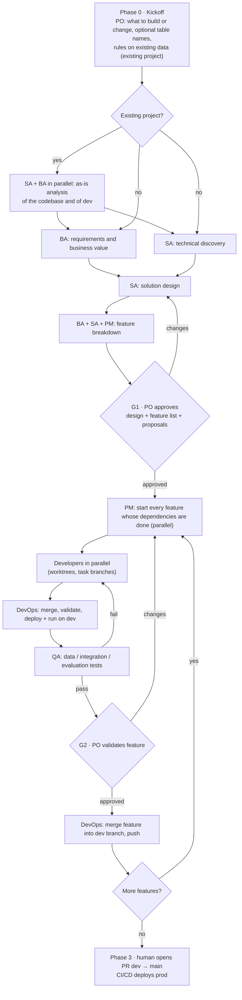

# DeltaForce AI — Design

Status: **Draft v0.1** · 2026-09-14 · design agreed in discussion with the maintainer, no code yet.

## 1. Goal

DeltaForce AI is an installable Claude Code framework that gives a project repository a team of specialized agents able to design, build, test and deploy on Databricks — data engineering, analytics, data science, ML and GenAI.

It is installed from GitHub with `install.sh` into a **target project repo**, configured through a config file, and wires up the Databricks AI tooling (agent skills + MCP server) so the team can operate against a real Databricks workspace.

## 2. Constraints and decisions

| Topic | Decision |
|---|---|
| Agent runtime | Claude Code only |
| Install scope | **Project only, never global**: skills, MCP server, ai-dev-kit runtime and Claude Code config all live inside the target repo |
| Team OS | Windows (installer and hooks run under Git Bash); CI runners are Linux |
| Deployment unit | Databricks Asset Bundles (DABs): **every** Databricks resource is declared in the bundle and deployed by the DevOps Engineer; MCP tools are only for reading, querying and running, and their create/update/delete actions are blocked by hooks |
| Prod deployment | Only through CI/CD — Azure DevOps now, GitHub Actions later |
| Language | Agent prompts, templates and repo docs in English |
| Data architecture | Medallion (bronze/silver/gold) for every discipline: DE, analytics, ML, AI |
| Parameters | Every environment-specific value (catalog, schemas, table names, endpoints) is a variable |
| Git | Never push to `main`. Work lands in a dev branch. The PR to `main` is opened by a human |
| PO involvement | Approves design + feature list once (G1), validates **every** feature (G2), and is consulted on blockers or changes to the request |
| Feature cadence | Independent features run in parallel (up to three active); a feature starts when its dependencies are done; the PO validates every feature |
| Backlog | Markdown files in the repo, machine-readable (future monitoring app) |
| Deliverables | Functional Analysis (Business Analyst) and Architecture (Solution Architect): English, Markdown, standard DeltaForce structure, versioned with a *Document control* table (`1.0 — Approved` at G1), under `.deltaforce/` |
| Production data | Production is a separate workspace. Every role that works with data may read from it — SQL queries, model and vector search calls, Genie, table stats — and every access is audited with the role that made it; every other activity on prod is blocked by hooks |

## 3. Two repositories

- **DeltaForce AI (this repo)** — the framework: agent definitions, skills/commands, hooks, templates, installer, schemas.
- **Target project repo** — where the team works. The installer copies templates into it and configures Databricks tooling. All project state (backlog, events, audit) lives here.

## 4. Team

The PO is the human user. The PM is the main Claude Code session (`"agent": "pm"` in the project's `.claude/settings.json`, so every session — terminal or VS Code — starts as the PM); every other role is a subagent in `.claude/agents/`. Agents are rendered by the installer from `lib/data/roles.yaml` (frontmatter) and `templates/claude/agents/<role>.md` (prompt).

| Role (id) | Responsibilities | May | May not |
|---|---|---|---|
| **PM** (`pm`) | Intake, planning, feature sequencing, backlog owner, PO reports and escalations | Read everything, write backlog/state/reports, delegate | Write source code, change Databricks resources |
| **Solution Architect** (`solution-architect`) | End-to-end solution design, medallion flows, table naming proposal, ADRs, bundle layout, design conformance review | Read UC metadata, write `.deltaforce/architecture/` | Write source code, deploy |
| **Business Analyst** (`business-analyst`) | Business objectives, expected value and success metrics; requirements and user stories traced to objectives; acceptance criteria; functional support to team and PM | Read-only data discovery, write `.deltaforce/requirements/` | Write source code, deploy |
| **Data Engineer** (`data-engineer`) | Ingestion, bronze → silver → gold pipelines, jobs | Write `src/pipelines`, run SQL/code on dev, `bundle validate` | Deploy |
| **Data Analyst** (`data-analyst`) | Gold marts, metric views, AI/BI dashboards, Genie spaces; supports QA on data tests | Query dev, write dashboards/metric views | Deploy |
| **Data Scientist** (`data-scientist`) | EDA, feature engineering, training, MLflow experiments, UC model registration | Run code on dev, MLflow | Deploy |
| **AI Engineer** (`ai-engineer`) | RAG, Vector Search, Agent Bricks / custom agents, GenAI evaluation, serving, apps | Vector Search / serving on dev, write `src/ai`, `src/apps` | Deploy |
| **QA Engineer** (`qa-engineer`) | Data quality tests, integration tests, ML/AI evaluation gates | Run tests on dev, read everything, write `tests/` | Modify source code |
| **DevOps Engineer** (`devops-engineer`) | Integration: merge task branches, `bundle validate/deploy/run` on dev, CI/CD definitions, push to dev branch | Deploy and run on **dev** only, write `cicd/`, git merge/push | Touch prod, write business code, push to `main` |

### Skills per role

Skills come from `databricks aitools` (official `databricks/databricks-agent-skills`) and are preloaded through the subagent `skills:` frontmatter. All roles get `databricks-core`.

| Role | Skills |
|---|---|
| solution-architect | `databricks-dabs`, `databricks-unity-catalog`, `databricks-docs`, `databricks-metric-views` |
| business-analyst | `databricks-data-discovery` |
| data-engineer | `databricks-pipelines`, `databricks-jobs`, `databricks-dabs`, `databricks-lakeflow-connect`, `databricks-spark-structured-streaming` |
| data-analyst | `databricks-dbsql`, `databricks-aibi-dashboards`, `databricks-metric-views`, `databricks-data-discovery` |
| data-scientist | `databricks-ml-training`, `databricks-synthetic-data-gen`, `databricks-python-sdk` |
| ai-engineer | `databricks-agent-bricks`, `databricks-vector-search`, `databricks-model-serving`, `databricks-mlflow-evaluation`, `databricks-ai-functions`, `databricks-apps-python` |
| qa-engineer | `databricks-dbsql`, `databricks-mlflow-evaluation`, `databricks-synthetic-data-gen` |
| devops-engineer | `databricks-dabs`, `databricks-jobs`, `databricks-pipelines` |

Default models (overridable in config): `pm` and `solution-architect` on Opus, the other roles on Sonnet.

### Example agent definition

```markdown
---
name: data-engineer
description: Builds ingestion and medallion pipelines (bronze/silver/gold) and jobs on Databricks. Use for data pipeline tasks of the current feature.
model: sonnet
isolation: worktree
color: blue
skills:
  - databricks-core
  - databricks-pipelines
  - databricks-jobs
  - databricks-dabs
tools: Read, Edit, Write, Grep, Glob, Bash, Agent(data-engineer), mcp__databricks__execute_sql, mcp__databricks__execute_code, mcp__databricks__get_table_stats_and_schema
---
```

## 5. Process



- **Phase 0 — Kickoff** (`/df-kickoff`): the PO states *what the team must build* and provides the elements: catalog, schema(s), optional table names, dev branch. Stored in `.deltaforce/config.yaml` and `.deltaforce/requirements/request.md`.
- **Existing projects**: the team is used to extend a working project as well as to build a new one. The kickoff finds product content in the repository (code, bundle resources, tests, CI/CD, a bundle DeltaForce did not create) and the PO confirms; the PO also gives the rules on existing data and objects — for example, existing tables in dev are never dropped, except the Auto Loader tables that are dropped with their checkpoint to refresh them — and what the team must not touch. Everything project-specific is captured there, in `.deltaforce/conventions.yaml` (`project.kind`, `data_rules`, `bundle.variables`), not in extra installer steps or hook rules. Phase 1 then starts with the **as-is analysis**, SA and BA in parallel and read-only: `architecture/as-is.md` (codebase, bundle and the variables that hold catalog and schemas, data on dev and how it is loaded, observed conventions, CI/CD, technical debt) and `requirements/as-is.md` (outputs, business rules found in the code, KPIs, gaps). Conventions and bundle variables found there are confirmed by the PO with the other open questions. Requirements and architecture describe the change (new, changed, unchanged); builders follow the data rules and list every destructive operation in their reports; QA adds regression checks; the G2 report shows destructive operations and regression evidence. The installer does not redefine bundle variables the project already has.
- **Phase 1 — Discovery & design**: in parallel, the BA writes requirements (business objectives, value, success metrics, user stories) and the SA does the technical discovery (data sources, workspace capabilities, architecture options); questions for the PO from both are asked in one round; then the SA designs the full solution (architecture, medallion flows for each discipline, table naming proposal when the PO gave none); BA + SA + PM derive the feature list with dependencies and per-role tasks. **G1**: PO approves once.
- **Phase 2 — Delivery**: the goal is to complete features — one, or several in parallel when they do not depend on each other (up to three active). Per feature: parallel development → integration and dev deploy by DevOps (from the integration branch) → QA → PM feature report → **G2**: PO validates that feature. A feature starts only when its dependencies are done; the team keeps working on other active features while the PO reviews.
- **Escalation** at any time, and only then: blocker, ambiguity, or a change compared to the request.
- **Phase 3 — Handover**: dev branch pushed and CI/CD definitions ready; a human opens the PR to `main`; CI/CD deploys prod.

### Status model

- Feature: `todo → in_progress → integrating → in_test → awaiting_po → done`, plus `blocked`. A G2 rejection moves `awaiting_po → in_progress`. Only a PO decision moves a feature to `done`.
- Task: `todo → in_progress → ready_for_integration → integrated → done`, plus `blocked`.

## 6. Orchestration model

**Decision: subagents as the backbone; agent teams evaluated and kept out of the MVP.**

- PM runs as the main session through the `agent` setting, so hooks see `agent_type: pm` too. Its prompt replaces the default Claude Code system prompt.
- Specialist roles are subagents.
- Subagents are stateless between calls; collaboration happens through repo artifacts (requirements, architecture, backlog) plus the delegation prompt written by the PM.

### Nested delegation

Subagents may spawn other subagents. Nesting depth comes from `orchestration.max_spawn_depth` in config (default `3`, Claude Code's own default), written to `CLAUDE_CODE_MAX_SUBAGENT_SPAWN_DEPTH`. Who may spawn whom is restricted per role with the `Agent(<agent_type>)` syntax in the `tools` frontmatter:

| Role | May spawn | Typical use |
|---|---|---|
| pm | every role | normal delegation of phase and feature work |
| solution-architect | data-engineer, data-analyst, data-scientist, ai-engineer, Explore | discipline feasibility checks while designing |
| business-analyst | data-analyst, Explore | data discovery to ground requirements |
| data-engineer | data-engineer | parallel sub-tasks (e.g. bronze, silver, gold of one task) |
| data-scientist | data-scientist, data-analyst | parallel experiments, EDA support |
| ai-engineer | ai-engineer, data-engineer | parallel RAG components, document ingestion pipeline |
| qa-engineer | data-analyst | data test support: profiling, reconciliation queries |
| devops-engineer | none | single integrator, never delegates |

Rules:

- A parent integrates its children's work into its own task branch before reporting. DevOps still sees exactly one branch per backlog task.
- Consultations (e.g. SA → data-engineer feasibility check) produce findings, not branches. DevOps only merges branches listed in the backlog.
- Children report to their parent, parents report to the PM. The PM stays the only backlog writer.
- Guardrails apply at every level: hooks see the child's own `agent_type`, so a data-engineer spawned by the SA still cannot deploy.
- Token cost grows with depth and fan-out. Lower the depth in config if cost becomes an issue.

### Agent teams — evaluation (Claude Code docs, v2.1.2xx)

Agent teams (`CLAUDE_CODE_EXPERIMENTAL_AGENT_TEAMS=1`) run teammates as independent sessions with a shared task list and direct messaging. Reasons they don't fit delivery today:

- **Experimental**; in-process teammates are **not restored by `/resume`** — a project spans days and waits on PO gates.
- The shared task list lives in `~/.claude/tasks/<team>/` (user-local), not in the repo — conflicts with the repo backlog as single source of truth and with the monitoring app.
- Subagent `skills:` are **not applied to teammates** — per-role Databricks skill preloading is lost.
- Teammates inherit the lead's permission mode; no per-teammate mode at spawn; permission prompts bubble to the lead.
- Split panes are not supported in Windows Terminal (in-process mode only).
- Significantly higher token usage.
- When enabled, any subagent Claude names launches as a teammate — so the flag stays off by default.

**Where they could add value**: Phase 1 cross-discipline design review, with SA, DE, DS and AI Engineer challenging the design in parallel. `TaskCreated`, `TaskCompleted` and `TeammateIdle` hooks can act as quality gates there. Planned as an opt-in experiment (roadmap M6).

## 7. Git and branching

- The PO provides the **dev branch** (e.g. `dev` or `dev/customer-360`). The main checkout sits on it. `main` is only for prod / CI/CD triggers.
- The main checkout stays on the dev branch. The PM creates each feature branch `df/F-003` from the dev branch without checking it out, so several features can be active at once.
- Builder subagents use `isolation: worktree`. Project settings set `worktree.baseRef: "head"` (the default `"fresh"` branches from the remote default branch, `main`); each specialist then creates its task branch with an explicit start point: `git switch -c df/F-003-<role>-T<n> df/F-003`.
- Task branches are pushed to the remote for traceability.
- Worktrees contain only committed files. The kickoff commits the installer output (agents, skills, settings, bundle files, config) together with the request, and gate commits keep docs and backlog on the dev branch. Delegation prompts give requirements, design, backlog and conventions as absolute paths in the main checkout, since the PM updates them there during delivery.
- **Integration branch**: the dev target holds one bundle deployment, so deploying feature branches one after another would remove each other's resources. The DevOps Engineer rebuilds a local `df/integration` = dev branch + every active, integrated feature, and deploys that. It is never pushed. It lives in the gitignored worktree `.deltaforce/review/`, where all integration happens, so the main checkout never leaves the dev branch and the PO can open the deployed code before G2. When a feature is closed, the DevOps Engineer removes unused agent worktrees and `worktree-agent-*` branches.
- DevOps merges task branches into their feature branch, and after G2 merges the feature into the dev branch, pushes, and rebuilds the integration branch. The dev branch only contains PO-validated features.
- Commit trailers: `DeltaForce-Role: <role>` and `DeltaForce-Task: F-003/T-003.1`.
- Guard hook blocks: push to `main`/`master` (configurable protected list), force push, `reset --hard` on the dev branch, remote deletion of the dev branch.

```json
{
  "env": {
    "CLAUDE_CODE_MAX_SUBAGENT_SPAWN_DEPTH": "3",
    "CLAUDE_CODE_EXPERIMENTAL_AGENT_TEAMS": "0"
  },
  "worktree": { "baseRef": "head" }
}
```

## 8. Databricks conventions

### Parameters

- Config values become DABs variables: `catalog`, `schema_bronze`, `schema_silver`, `schema_gold`, and one variable per table.
- Medallion layout is configurable: `single_schema` (layer prefix on table names, default when the PO gives one schema) or `multi_schema` (one schema per layer).
- Table names: PO-provided, or proposed by the SA and approved at G1. Either way they are stored in config and generated into `resources/variables.yml`.
- **The dev catalog is the boundary, the installer's schemas are the starting point.** The team is free to create further schemas and tables inside the dev catalog when the solution needs them, as long as they are consistent with what is being built: they follow the medallion layers, are described in `.deltaforce/architecture/`, and are declared as bundle resources with variables (never created by hand). New objects coherent with the approved design need no PO escalation; objects that change the request do.
- Dev target uses `mode: development`; prod target uses `mode: production` with values injected by CI/CD (`BUNDLE_VAR_<name>`) and a service principal.
- No literal catalog/schema/table names in source: enforced by a hook on edits under `src/` and by QA review.

### Medallion across disciplines

| Layer | Data engineering / analytics | ML | GenAI |
|---|---|---|---|
| Bronze | Raw ingested data, raw files in volumes | Raw training sources | Raw documents (PDF, HTML) in volumes |
| Silver | Cleaned, conformed, deduplicated | Cleaned training data | Parsed and chunked documents |
| Gold | Business aggregates, marts, metric views | Feature tables, inference outputs | Vector index source tables, evaluation datasets |

UC assets follow the same parameters: models `${var.catalog}.${var.schema_gold}.<model>`, vector indexes on gold, serving endpoint and app names suffixed per target.

- **ML lifecycle**: EDA → gold feature table → MLflow training → UC model registration → evaluation → dev serving. QA checks metric thresholds.
- **AI lifecycle**: bronze documents → silver parse/chunk → gold vector index → agent (Agent Bricks or custom) → MLflow evaluation → dev serving or app. QA checks evaluation thresholds.

### Target project layout

```
databricks.yml
resources/              # jobs, pipelines, dashboards, serving, apps, variables.yml
src/
  pipelines/            # bronze/, silver/, gold/
  ml/                   # features/, training/, inference/
  ai/                   # agents/, rag/, evaluation/
  apps/
  dashboards/
tests/
  data_quality/
  integration/
  evaluation/
cicd/
  azure-devops/
  github/               # later
.deltaforce/            # team documents and state: config, conventions, requirements, architecture, backlog, reports, events
.claude/                # agents, skills, hooks, settings.json
CLAUDE.md
```

## 9. Backlog and observability contract

The backlog is designed to be read by a future monitoring app without changes.

```
.deltaforce/
  config.yaml           # installer answers (committed, no secrets); kickoff adds request and tables
  status.json           # doctor result gating /df-kickoff (gitignored)
  .databrickscfg        # project-local CLI profile (gitignored, with its .bak backups, which the installer deletes)
  bin/, runtime/        # uv, Databricks CLI, Python, AI Dev Kit, MCP venv (gitignored)
  conventions.yaml      # client conventions (created by the installer, filled at kickoff)
  state.yaml            # phase, active features, G1 decision, next steps, last update (created at kickoff)
  requirements/         # request.md, as-is.md (existing projects), functional-analysis.md
  architecture/         # as-is.md (existing projects), discovery.md, architecture.md, adr/
  backlog/F-003-silver-customer-dedup.md
  reports/F-003-po-review.md, tasks/T-003.1.md   # PO reviews; specialists' reports saved verbatim
  events.jsonl          # lifecycle events
  audit.jsonl           # tool calls per role
```

Feature file:

```markdown
---
id: F-003
title: Silver customer deduplication
status: in_test
depends_on: [F-001]
branch: df/F-003
tasks:
  - id: T-003.1
    role: data-engineer
    status: integrated
    branch: df/F-003-data-engineer-T1
  - id: T-003.2
    role: qa-engineer
    status: in_progress
po_decision: null        # approved | changes_requested, with timestamp and notes
created: 2026-09-14T10:00:00Z
updated: 2026-09-14T15:32:00Z
---
## User story
## Acceptance criteria
## Design references
## PO review
```

Event line: `{"ts", "session_id", "agent_id", "role", "event", "feature", "task", "data"}`. Event types: `phase_changed`, `feature_status_changed`, `task_status_changed`, `subagent_started`, `subagent_stopped`, `deploy_started`, `deploy_finished`, `test_run`, `po_decision`, `escalation`.

Single-writer rules:

- Worktree-isolated subagents cannot edit files in the main checkout, so **the PM is the only writer of backlog and state**, updating them from subagent results. DevOps updates integration status from the main checkout.
- Hooks append `events.jsonl` and `audit.jsonl` through `${CLAUDE_PROJECT_DIR}`, which stays on the main checkout.
- JSON Schemas for config, feature frontmatter and events live in the framework under `schemas/`.

### Monitor

**Implemented (base)** in `lib/monitor/`. A local web page that shows the project to the PO: what is happening now and what waits for the PO, the team (each role working, waiting or idle, with its current delegation or last action, next task and recent activity) and the feature board (to do, in progress with stage and task progress, waiting for the PO, done with completion date and cycle time). Features, agents and documents open in a side panel.

- **Read-only, zero tokens**: `server.py` (standard library HTTP server, bound to `127.0.0.1`, `Host` header checked) serves `static/` and a JSON snapshot built by `model.py` from `config.yaml`, `state.yaml`, the backlog, `events.jsonl`, `runtime/activity.jsonl` and the Markdown documents under `.deltaforce/` (never `framework/`, `runtime/`, `review/`, `bin/`). The page polls every 3 seconds with an ETag. Approvals stay in Claude Code.
- **Activity**: the hook records, besides tool calls on Bash and Databricks, delegations (`PreToolUse` on `Agent|Task`: target role, description, feature and task ids found in the prompt) and file edits (`PostToolUse` on `Edit|Write|NotebookEdit`), plus agent and session start and end. Every hook except the guard runs with `async: true`; `SessionEnd` stays synchronous so it is not cut short. Started and finished delegations in `events.jsonl` fill the history for projects without activity.
- **Starts automatically**: `launcher.py` (standard library) is called by the hook. `SessionStart` starts the server if it is not running; the first work event of a session (delegation, edit, command, subagent) opens the page once per session in the system browser (`webbrowser`). The server runs with the MCP virtual environment's `pythonw.exe`, detached (`CREATE_NO_WINDOW`, breakaway from the job object when allowed), and survives the Claude Code process. Its port is derived from the project path (8700–8799, next free port on collision) and recorded in `runtime/monitor.json`. It stops when no session is open and nothing happened for 30 minutes, or after 4 hours without activity. `bash .deltaforce/bin/df monitor` opens it on request; `DELTAFORCE_MONITOR=off` disables the automatic start.
- **Status line** (zero tokens): the installer sets `statusLine` in `.claude/settings.local.json` (unless the user has one of their own there) to source `lib/monitor/statusline.sh` with `refreshInterval: 15`. The script uses bash builtins only — it reads the port from `runtime/monitor.json` and fetches `/api/statusline` over `/dev/tcp` — because on Windows every extra process costs one to two seconds per refresh. The server formats the line (`statusline.py`): phase, features done, what waits for the PO, and the monitor address as an OSC 8 link. When the monitor does not answer, the script starts it in the background (`statusline.py --start`, at most once every 20 seconds).
- **Workflow** (panel and per feature): handoffs per pair of roles (hook `delegated` records, nested ones included; before the hooks existed, `delegation_started` events) with outcomes from `delegation_finished`; steps back — feature status changes to an earlier status, with the cause inferred from the status left (tests failed, integration or deploy failed, PO asked for changes) and the event reason — plus designs sent back at G1; deploys and test runs; phase durations from `phase_changed`; PO involvement — gate decisions and escalations from events, questions asked with `AskUserQuestion` (`PreToolUse`, counted as `asked_po`) and PO messages (`UserPromptSubmit`, `po_message` with the `/command` only). The text of questions and messages is never recorded. Each feature shows its path through the statuses with the steps back.
- **Next views**: event timeline, audit and guardrail denials, git branches.

## 10. Permissions, guardrails, audit

**Implemented** in `lib/hooks/deltaforce_hook.py` (standard library only, run with the MCP virtual environment's Python) and `lib/py/deltaforce/guardrails.py`. The installer registers the hook in `.claude/settings.local.json` for `PreToolUse`, `PostToolUse`, `SubagentStart`, `SubagentStop`, `SessionStart` and `SessionEnd` (only the `PreToolUse` guard is synchronous and blocking; the other hooks record audit and activity in the background and start the monitor), and generates its policy in `.deltaforce/runtime/guard-policy.json` from the config. It blocks writes outside the dev catalog and unqualified SQL writes; Unity Catalog governance changes; any non-read activity on the production workspace (only read SQL, model serving, vector search queries, Genie and table stats through `databricks-prod`, for roles with `prod_read`) and any Databricks CLI call to it; bundle deploy/run by roles other than the DevOps Engineer or outside the dev target, and bundle destroy; pushes to protected branches, force pushes, branch deletions, pushing `df/integration`, `reset --hard`, `rebase`, merges into the dev branch by other roles; edits of installer-managed files and access to the credentials file. It fails closed on production when the policy is missing or the hook errors. Static deny rules in `.claude/settings.json` back it up. Audit records (Databricks calls, shell commands, denials) go to `.deltaforce/audit.jsonl` (gitignored), agent activity to `.deltaforce/runtime/activity.jsonl` for the monitoring view. The doctor runs a self-test. Everything DeltaForce installs — agents, DeltaForce and Databricks skills, Claude settings, `.mcp.json`, `CLAUDE.md`, `.gitignore`, generated bundle variables, config, framework, tools and runtime — is off-limits to agents: edits, write commands and commits that include those files are blocked, the installer commits them itself, and the doctor checks that agents and skills still match what was installed. `.deltaforce/conventions.yaml` is changed only by the PM. Where the plan below differs, this paragraph wins.

- **Tool allowlists** per role in agent frontmatter, including individual MCP tools (`mcp__databricks__execute_sql` yes, `mcp__databricks__manage_jobs` only for DevOps).
- **Hooks in Python**, run with `uv run`, portable between Windows (Git Bash) and Linux CI. Tool-event hooks receive `agent_type`, which maps to the role policy:
  - `PreToolUse` guard: bundle deploy/run only for `devops-engineer` and only on dev target; protected-branch git rules; destructive SQL (`DROP`, `DELETE`, `TRUNCATE`) outside the dev catalog; literal catalog/schema names in `src/`.
  - `PostToolUse` → `audit.jsonl`; `SubagentStart`/`SubagentStop` → `events.jsonl`.
- **Commit trailers** give durable per-role traceability in git history.
- **Databricks identity**: in the MVP all roles share the user's CLI profile, so Databricks audit logs don't distinguish roles and enforcement is Claude-side. Later: dedicated service principals (at least for DevOps) with UC grants for hard enforcement.
- **No secrets in repo**: OAuth via `databricks auth login`, profiles in `~/.databrickscfg`; config stores only the profile name.

## 11. Installer

**The installer only installs.** It asks for the technical environment, installs everything, and finishes with the doctor. `/df-kickoff` (what to build, table names) starts only once the doctor reports ready.

**Everything is project-scoped — nothing is installed globally.** Git for Windows and Claude Code are checked, never installed. With OAuth, the Databricks CLI keeps its token cache in the user profile; that cache is the only user-level artifact.

**The whole installation happens in the IDE's integrated terminal, with one command** — no separate windows, no manual cloning. The command (PowerShell, Command Prompt and Git Bash variants in the README) clones the framework into `.deltaforce/framework` if missing and runs `bash .deltaforce/framework/install.sh`. The same command updates and reconfigures later.

`install.sh` bootstraps itself: when it runs without its `lib/` folder (e.g. piped) it clones `DF_REPO_URL` at `DF_REF` (default `main`) into `.deltaforce/framework`; when it runs from `.deltaforce/framework` it fetches `DF_REF` first; then it re-executes the fresh copy. `--help` and `--doctor` skip the update. The framework copy is gitignored.

```bash
bash .deltaforce/framework/install.sh [--target DIR] [--advanced] [--non-interactive] [--yes] [--dry-run] [--doctor]
```

Steps (implemented in `install.sh` + `lib/`):

1. **Preflight** — bash ≥ 4, `git`, `curl`, `tar`, `unzip` (Windows); offers `git init` when the folder is not a repository (never during `--dry-run`); must be the repository root; Windows path length vs `LongPathsEnabled`; Claude Code detected; conflicting `DATABRICKS_*` environment variables are ignored and reported.
2. **Questions, part 1** — project name, protected branches, dev branch, CI/CD provider (git provider detected from `origin`), workspace URL, CLI profile name (never `DEFAULT`), auth method (`oauth` default, `pat`, `service-principal`). Values from an existing config are the defaults. `--dry-run` prints the plan here and exits.
3. **Git and project-local tools** — after confirmation, the dev branch is checked out; if missing, the installer offers to create it (with an initial empty commit in an empty repository) and to push it when a remote exists. Then uv and Databricks CLI downloaded from their GitHub releases into `.deltaforce/bin/` at the versions pinned in `lib/data/versions.env`; Python installed by uv into `.deltaforce/runtime/python` (`UV_PYTHON_INSTALL_DIR`, `UV_CACHE_DIR`, `UV_LINK_MODE=copy` because OneDrive rejects hardlinks).
4. **Authentication** — profile written to `.deltaforce/.databrickscfg` through `DATABRICKS_CONFIG_FILE`: `databricks auth login` (OAuth), `databricks configure` (PAT, token read hidden) or a client ID/secret section (service principal); verified with `current-user me`.
5. **Questions, part 2** (live lists from the workspace) — SQL warehouse, compute (serverless or cluster), dev catalog (must exist; re-asked otherwise), medallion layout and schema(s); missing schemas are created (`databricks schemas create`). With `--advanced`: roles, default model, nesting depth, AI Dev Kit ref.
6. **Configuration** — `.deltaforce/config.yaml`, validated against `schemas/config.schema.json`.
7. **AI Dev Kit MCP server** — sparse, shallow clone of `databricks-mcp-server` and `databricks-tools-core` at the pinned ref into `.deltaforce/runtime/ai-dev-kit` (`core.longpaths=true`), venv in `.deltaforce/runtime/venv` built directly with uv (the upstream `setup.sh`/`mcp_install.sh` assume Unix venv paths).
8. **Databricks skills** — `databricks aitools install --path .claude/skills --skills <union of role skills>`: plain folders, no symlinks and no global state (aitools project scope symlinks, which Windows restricts).
9. **Generated files** — from the config: `.mcp.json` (absolute paths, gitignored), `.claude/settings.json` (nesting depth, agent teams off, `worktree.baseRef: head`, `enabledMcpjsonServers`), `.claude/settings.local.json` (`DATABRICKS_CONFIG_FILE` + profile for every Bash call), the `CLAUDE.md` project-context block, `databricks.yml` (created once) and `resources/deltaforce.variables.yml` (dev values only; prod values must come from CI/CD; variables that the project's own bundle files already define are left out), a managed `.gitignore` block.
10. **Doctor** — config, Claude Code, git and dev branch, tool versions, authentication, warehouse/cluster, catalog and schemas, MCP server import, skills, generated files, `bundle validate -t dev` (warning only). Result in `.deltaforce/status.json`; `/df-kickoff` requires `ready: true`. Rerun with `--doctor`.

The installer is idempotent: re-runs reuse downloaded tools, the AI Dev Kit checkout at the same ref, and regenerate managed files without touching user content outside managed blocks.

## 12. Framework repository layout

```
deltaforce-ai/
  install.sh
  lib/
    *.sh                # installer steps
    data/roles.yaml     # role catalog: models, tools, MCP tools, delegates, skills
    data/versions.env   # pinned downloads
    py/dfcli.py         # helper CLI (installer, and .deltaforce/bin/df for the team)
    py/deltaforce/      # config, generate, team, backlog, doctor, guardrails
    hooks/              # deltaforce_hook.py: guardrails, audit, activity (standard library only)
    monitor/            # launcher, server, model, static page (read-only local web view)
  templates/
    claude/agents/      # prompt body per role; frontmatter comes from roles.yaml
    claude/skills/      # df-* skills copied into the project
    deltaforce/conventions.yaml
  schemas/              # config, conventions, state, feature, event
  examples/             # valid sample files used by tests
  docs/                 # design.md, roadmap.md
  tests/
```

DeltaForce skills:

| Skill | Kind | Purpose |
| --- | --- | --- |
| `df-kickoff` | PO command | Readiness gate, new or existing project, request, tables, rules on existing data, client conventions, start the analysis |
| `df-status` | PO command | Read-only project status |
| `df-approve` | PO command | Approve G1 or a feature at G2 |
| `df-changes` | PO command | Changes at G1, at G2, or to the request |
| `df-conventions` | PO command | Show or change client conventions |
| `df-engineering-standards` | preloaded | Medallion, bundle variables, layout, naming, quality, conventions precedence |
| `df-backlog` | preloaded | State, feature, event and report formats; `df event` / `df validate` |
| `df-git-flow` | preloaded | Dev, feature, task and integration branches; commits; forbidden operations |
| `df-handoff` | preloaded | Delegation prompt and report formats, nested delegation, escalation |
| `df-testing` | preloaded | Data quality, integration, ML and GenAI evaluation, evidence |

Hooks (guardrails, audit, activity) and the monitor are described in §9 and §10.

## 13. Open items to validate during build

- Task branch naming inside Claude-created worktrees: rename on start vs custom `WorktreeCreate` hook.
- `agent_type` present in hook input for every role subagent and for `--agent pm`, on Windows.
- Nested delegation: whether `SubagentStart` exposes the parent agent, so `events.jsonl` can record the full delegation chain; worktree behaviour when a worktree-isolated subagent spawns another (`baseRef: "head"` should resolve to the parent worktree).
- `.mcp.json` MCP server usable from worktree-isolated subagents, together with per-role MCP tool allowlists.
- Whether installed `.claude/skills` are committed (proposed: yes, for reproducibility) and how the `skills:` preload resolves them.
- ~~`targets.dev.variables` in the included `resources/deltaforce.variables.yml` merged by `bundle validate`~~ — confirmed on a real workspace (2026-09-14).
- ai-dev-kit MCP server maintenance is best-effort upstream: pin the ref and keep a fallback to the Databricks CLI for critical operations (deploy, run).
